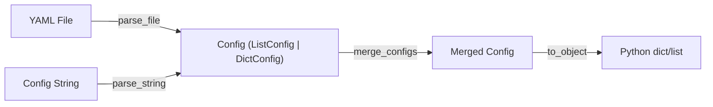
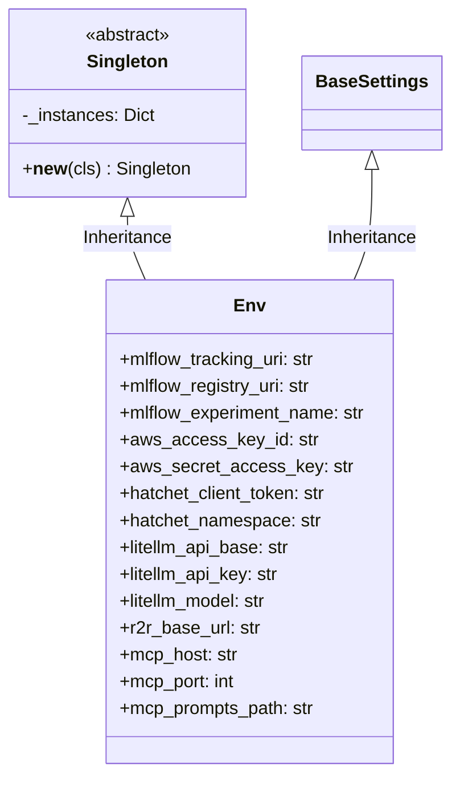

# Module Specification: Infrastructure IO

* **Source Reference:** `src/autogen_team/infrastructure/io/` (2 files)
* **Downstream Consumers:** All layers via `Env` singleton, [[Modules/Application/Jobs]] via config parsing

## 1. OmegaConf Config Parsing (`configs.py`)

**Source:** `src/autogen_team/infrastructure/io/configs.py:L1-L69`

Provides parse, merge, and convert operations for OmegaConf configuration objects.

| Function | Signature | Purpose |
| :--- | :--- | :--- |
| `parse_file(path)` | `str -> Config` | Load YAML from disk via `OmegaConf.load()` |
| `parse_string(string)` | `str -> Config` | Parse inline config string via `OmegaConf.create()` |
| `merge_configs(configs)` | `Sequence[Config] -> Config` | Deep merge multiple configs via `OmegaConf.merge()` |
| `to_object(config, resolve)` | `Config -> object` | Convert to Python object with optional variable resolution |

## 2. Environment Variables Singleton (`osvariables.py`)

**Source:** `src/autogen_team/infrastructure/io/osvariables.py:L15-L53`

### Configuration Groups

| Group | Variables | Purpose |
| :--- | :--- | :--- |
| **MLflow** | `mlflow_tracking_uri`, `mlflow_registry_uri`, `mlflow_experiment_name`, `mlflow_registered_model_name` | Experiment tracking & model registry |
| **S3/MinIO** | `aws_access_key_id`, `aws_secret_access_key`, `mlflow_s3_endpoint_url`, `mlflow_s3_ignore_tls` | Object storage auth |
| **Hatchet** | `hatchet_client_token`, `hatchet_namespace`, `hatchet_client_host_port`, `hatchet_client_server_url`, `hatchet_client_tls_strategy` | Workflow orchestration |
| **LiteLLM** | `litellm_api_base`, `litellm_api_key`, `litellm_model` | LLM gateway |
| **R2R** | `r2r_base_url` | RAG API |
| **MCP** | `mcp_host`, `mcp_port`, `mcp_prompts_path` | MCP server |
