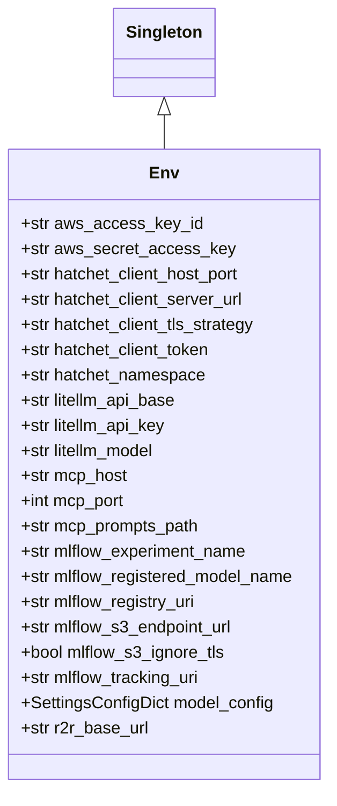

# Module Specification: Osvariables

* **Source Reference:** `src/autogen_team/infrastructure/io/osvariables.py`

## UML Diagrams

```mermaid
classDiagram
    class Env {
        +str aws_access_key_id
        +str aws_secret_access_key
        +str hatchet_client_host_port
        +str hatchet_client_server_url
        +str hatchet_client_tls_strategy
        +str hatchet_client_token
        +str hatchet_namespace
        +str litellm_api_base
        +str litellm_api_key
        +str litellm_model
        +str mcp_host
        +int mcp_port
        +str mcp_prompts_path
        +str mlflow_experiment_name
        +str mlflow_registered_model_name
        +str mlflow_registry_uri
        +str mlflow_s3_endpoint_url
        +bool mlflow_s3_ignore_tls
        +str mlflow_tracking_uri
        +SettingsConfigDict model_config
        +str r2r_base_url
    }
    class Singleton {
    }
    Singleton <|-- Env
```
