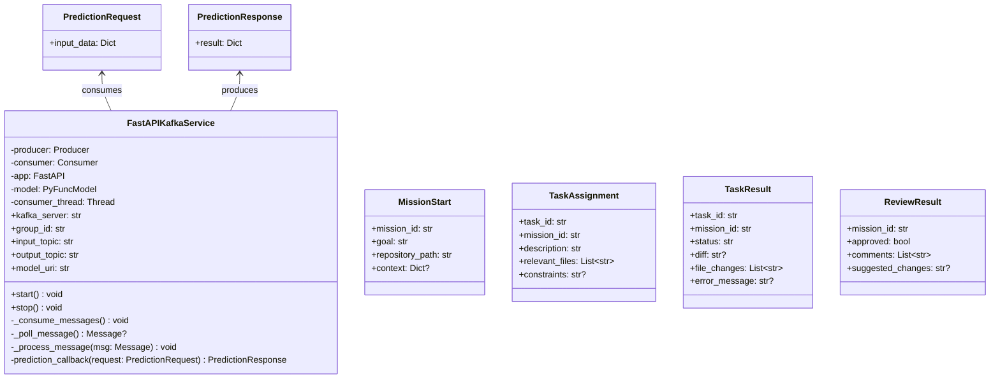

# Module Specification: Infrastructure Messaging

* **Source Reference:** `src/autogen_team/infrastructure/messaging/` (2 files)
* **Upstream Dependencies:** [[Modules/Core/Schemas]], [[Modules/Models/Entities]]

## 1. UML 2.0 Class Diagram

## 2. FastAPIKafkaService

**Source:** `src/autogen_team/infrastructure/messaging/kafka_app.py:L86-L234`

### Lifecycle

1. **`start()`** (L120-L158): Initializes Kafka producer/consumer, loads PyFunc model from MLflow, starts FastAPI with `/health` endpoint, spawns consumer daemon thread.
2. **`_consume_messages()`** (L160-L175): Background loop polling Kafka topic.
3. **`_process_message(msg)`** (L177-L219): Deserializes JSON, calls `prediction_callback`, produces result to output topic, commits offset.
4. **`stop()`** (L221-L238): Closes consumer, flushes producer.

### Configuration

| Parameter | Default | Source |
| :--- | :--- | :--- |
| `kafka_server` | `DEFAULT_KAFKA_SERVER` (env var) | `kafka_app.py:L60-L66` |
| `group_id` | `DEFAULT_GROUP_ID` (env var) | `kafka_app.py:L60-L66` |
| `input_topic` | `DEFAULT_INPUT_TOPIC` (env var) | `kafka_app.py:L60-L66` |
| `output_topic` | `DEFAULT_OUTPUT_TOPIC` (env var) | `kafka_app.py:L60-L66` |

### Error Handling

- Consumer uses manual commit (`enable.auto.commit: false`)
- Auto offset reset: `latest`
- Delivery report callback for producer acknowledgment

## 3. A2A Protocol

**Source:** `src/autogen_team/infrastructure/messaging/a2a_protocol.py:L1-L45`

Pydantic models for inter-agent communication:

| Model | Purpose | Key Field |
| :--- | :--- | :--- |
| `MissionStart` | Event to start a new autonomous mission | `mission_id`, `goal` |
| `TaskAssignment` | Assign a coding task to a Coder Agent | `task_id`, `relevant_files` |
| `TaskResult` | Return from a Coder Agent execution | `status` (completed\|failed), `diff` |
| `ReviewResult` | Return from a Reviewer Agent | `approved`, `comments` |
