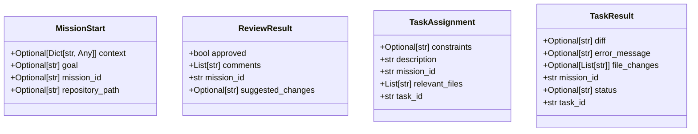

# Module Specification: A2A Protocol

* **Source Reference:** `src/autogen_team/infrastructure/messaging/a2a_protocol.py`

## UML Diagrams

```mermaid
classDiagram
    class MissionStart {
        +Optional[Dict[str, Any]] context
        +Optional[str] goal
        +Optional[str] mission_id
        +Optional[str] repository_path
    }
    class ReviewResult {
        +bool approved
        +List[str] comments
        +str mission_id
        +Optional[str] suggested_changes
    }
    class TaskAssignment {
        +Optional[str] constraints
        +str description
        +str mission_id
        +List[str] relevant_files
        +str task_id
    }
    class TaskResult {
        +Optional[str] diff
        +Optional[str] error_message
        +Optional[List[str]] file_changes
        +str mission_id
        +Optional[str] status
        +str task_id
    }
```
