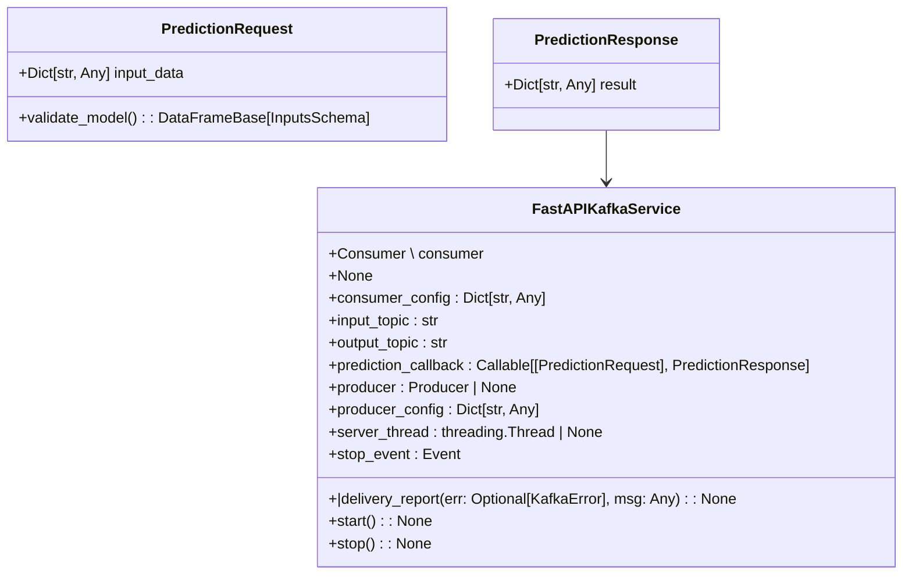

# Module Specification: Kafka App

* **Source Reference:** `src/autogen_team/infrastructure/messaging/kafka_app.py`

## UML Diagrams

```mermaid
classDiagram
    class FastAPIKafkaService {
        +Consumer \ consumer
        +None
        +consumer_config : Dict[str, Any]
        +input_topic : str
        +output_topic : str
        +prediction_callback : Callable[[PredictionRequest], PredictionResponse]
        +producer : Producer \| None
        +producer_config : Dict[str, Any]
        +server_thread : threading.Thread \| None
        +stop_event : Event
        +|delivery_report(err: Optional[KafkaError], msg: Any): None
        +start(): None
        +stop(): None
    }
    class PredictionRequest {
        +Dict[str, Any] input_data
        +validate_model(): DataFrameBase[InputsSchema]
    }
    class PredictionResponse {
        +Dict[str, Any] result
    }
    PredictionResponse --> FastAPIKafkaService
```
