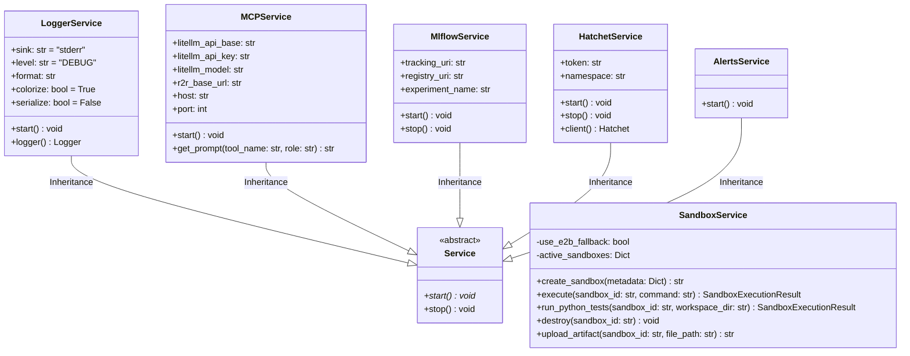

# Module Specification: Infrastructure Services

* **Source Reference:** `src/autogen_team/infrastructure/services/` (7 service files)
* **Downstream Consumers:** [[Modules/Application/Jobs]], [[Modules/Application/Agents]], [[Modules/Application/MCPTools]]

## 1. UML 2.0 Class Diagram

## 2. Service Specifications

### `Service` (abstract base) (`src/autogen_team/infrastructure/services/logger_service.py:L27-L35`)

Abstract base class for all global services. Uses Pydantic `BaseModel` with `strict=True, frozen=True, extra="forbid"`.

### `LoggerService` (`src/autogen_team/infrastructure/services/logger_service.py:L38-L88`)

Structured logging with OpenTelemetry integration:
- Configures `loguru` logger with customizable sink, level, format
- Sets up `TracerProvider` with OTLP span exporter
- Sets up `LoggerProvider` with OTLP log exporter
- Propagates loguru logs to standard Python logging via `PropagateHandler`

### `MCPService` (`src/autogen_team/infrastructure/services/mcp_service.py:L17-L84`)

Configuration and utilities for the MCP tool server:
- Loads LiteLLM configuration from `Env` singleton
- Loads MCP prompts from YAML config file (`confs/mcp_prompts.yaml`)
- Provides `get_prompt(tool_name, role)` for retrieving system prompts

### `HatchetService` (`src/autogen_team/infrastructure/services/hatchet_service.py:L15-L86`)

Manages the Hatchet workflow orchestration client:
- Lazy initialization via `client` property
- Automatic mock fallback for local development and tests
- Environment variable forwarding (`HATCHET_CLIENT_TOKEN`, `HATCHET_CLIENT_HOST_PORT`, etc.)

### `SandboxService` (`src/autogen_team/infrastructure/services/sandbox_service.py:L39-L189`)

Manages ephemeral MicroVM sandboxes:
- Creates E2B Code Interpreter sandboxes (Firecracker-based)
- Executes commands with configurable timeout
- Uploads sandbox artifacts to MinIO/S3 via boto3
- Path traversal protection via `safe_join()`
