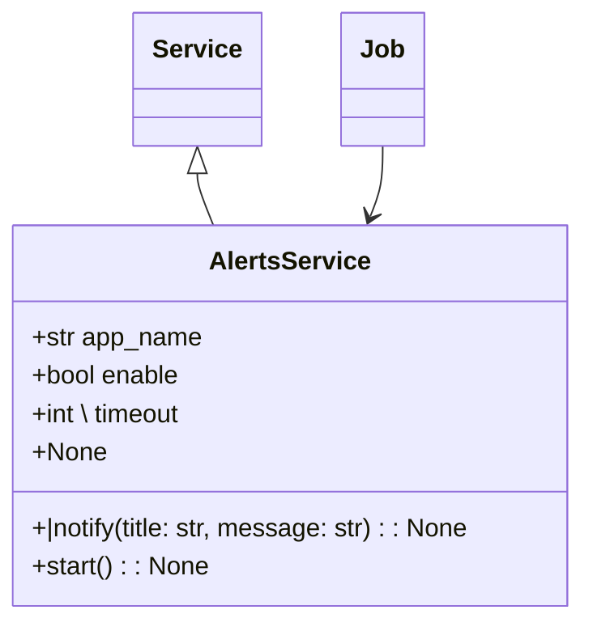

# Module Specification: Alert Service

* **Source Reference:** `src/autogen_team/infrastructure/services/alert_service.py`

## UML Diagrams

```mermaid
classDiagram
    class AlertsService {
        +str app_name
        +bool enable
        +int \ timeout
        +None
        +|notify(title: str, message: str): None
        +start(): None
    }
    Service <|-- AlertsService
    Job --> AlertsService
```
