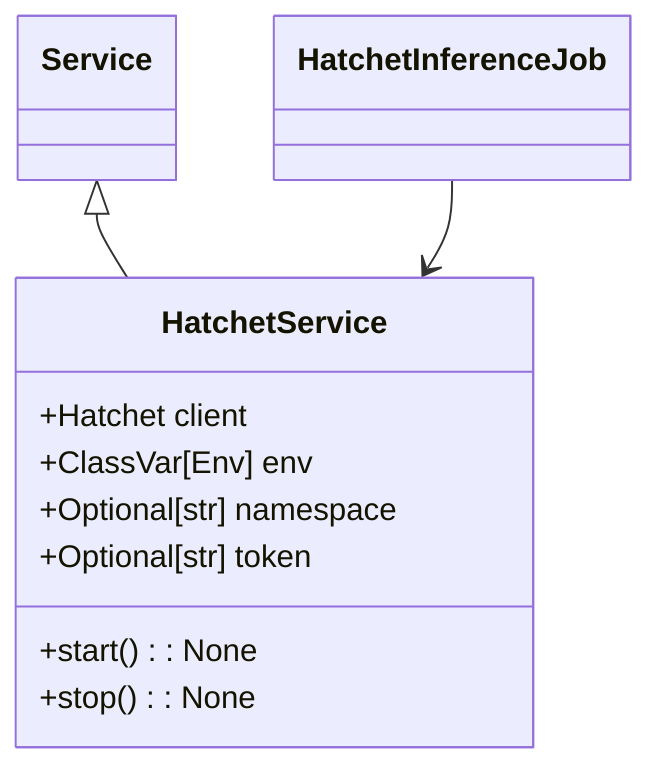

# Module Specification: Hatchet Service

* **Source Reference:** `src/autogen_team/infrastructure/services/hatchet_service.py`

## UML Diagrams

```mermaid
classDiagram
    class HatchetService {
        +Hatchet client
        +ClassVar[Env] env
        +Optional[str] namespace
        +Optional[str] token
        +start(): None
        +stop(): None
    }
    Service <|-- HatchetService
    HatchetInferenceJob --> HatchetService
```
