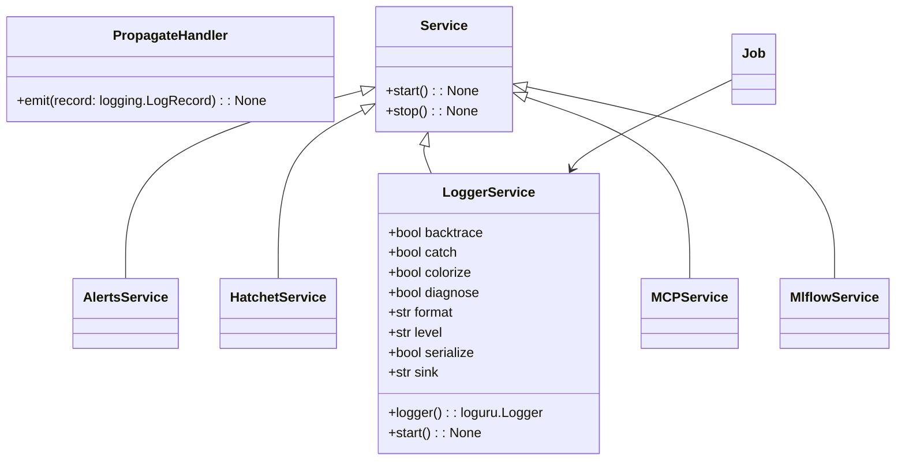

# Module Specification: Logger Service

* **Source Reference:** `src/autogen_team/infrastructure/services/logger_service.py`

## UML Diagrams

```mermaid
classDiagram
    class LoggerService {
        +bool backtrace
        +bool catch
        +bool colorize
        +bool diagnose
        +str format
        +str level
        +bool serialize
        +str sink
        +logger(): loguru.Logger
        +start(): None
    }
    class PropagateHandler {
        +emit(record: logging.LogRecord): None
    }
    class Service {
        +start(): None
        +stop(): None
    }
    Service <|-- AlertsService
    Service <|-- HatchetService
    Service <|-- LoggerService
    Service <|-- MCPService
    Service <|-- MlflowService
    Job --> LoggerService
```
