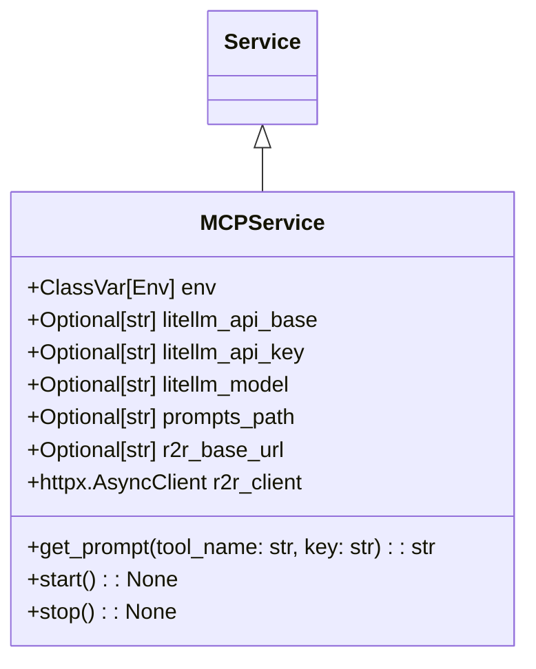

# Module Specification: Mcp Service

* **Source Reference:** `src/autogen_team/infrastructure/services/mcp_service.py`

## UML Diagrams

```mermaid
classDiagram
    class MCPService {
        +ClassVar[Env] env
        +Optional[str] litellm_api_base
        +Optional[str] litellm_api_key
        +Optional[str] litellm_model
        +Optional[str] prompts_path
        +Optional[str] r2r_base_url
        +httpx.AsyncClient r2r_client
        +get_prompt(tool_name: str, key: str): str
        +start(): None
        +stop(): None
    }
    Service <|-- MCPService
```
