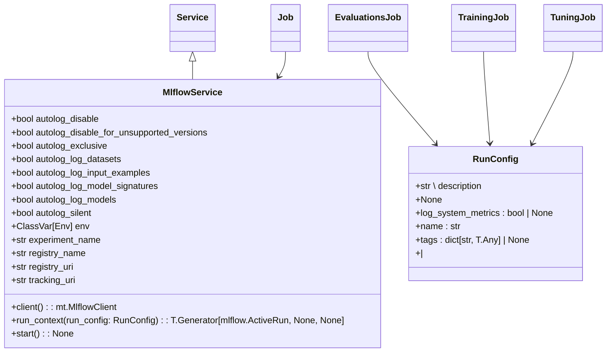

# Module Specification: Mlflow Service

* **Source Reference:** `src/autogen_team/infrastructure/services/mlflow_service.py`

## UML Diagrams

```mermaid
classDiagram
    class MlflowService {
        +bool autolog_disable
        +bool autolog_disable_for_unsupported_versions
        +bool autolog_exclusive
        +bool autolog_log_datasets
        +bool autolog_log_input_examples
        +bool autolog_log_model_signatures
        +bool autolog_log_models
        +bool autolog_silent
        +ClassVar[Env] env
        +str experiment_name
        +str registry_name
        +str registry_uri
        +str tracking_uri
        +client(): mt.MlflowClient
        +run_context(run_config: RunConfig): T.Generator[mlflow.ActiveRun, None, None]
        +start(): None
    }
    class RunConfig {
        +str \ description
        +None
        +log_system_metrics : bool \| None
        +name : str
        +tags : dict[str, T.Any] \| None
        +|
    }
    Service <|-- MlflowService
    Job --> MlflowService
    EvaluationsJob --> RunConfig
    TrainingJob --> RunConfig
    TuningJob --> RunConfig
```
