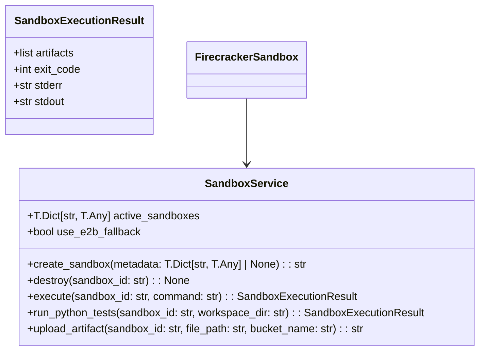

# Module Specification: Sandbox Service

* **Source Reference:** `src/autogen_team/infrastructure/services/sandbox_service.py`

## UML Diagrams

```mermaid
classDiagram
    class SandboxExecutionResult {
        +list artifacts
        +int exit_code
        +str stderr
        +str stdout
    }
    class SandboxService {
        +T.Dict[str, T.Any] active_sandboxes
        +bool use_e2b_fallback
        +create_sandbox(metadata: T.Dict[str, T.Any] \| None): str
        +destroy(sandbox_id: str): None
        +execute(sandbox_id: str, command: str): SandboxExecutionResult
        +run_python_tests(sandbox_id: str, workspace_dir: str): SandboxExecutionResult
        +upload_artifact(sandbox_id: str, file_path: str, bucket_name: str): str
    }
    FirecrackerSandbox --> SandboxService
```
