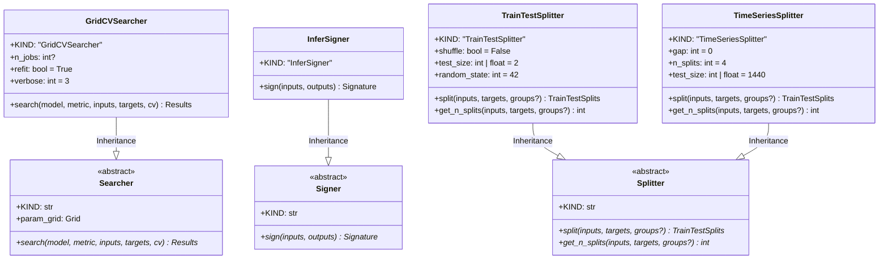

# Module Specification: Infrastructure Utils

* **Source Reference:** `src/autogen_team/infrastructure/utils/` (3 files)
* **Downstream Consumers:** [[Modules/Application/Jobs]] (TuningJob, TrainingJob, EvaluationsJob)

## 1. UML 2.0 Class Diagram

## 2. Searchers (`searchers.py:L1-L118`)

Hyperparameter search using scikit-learn `GridSearchCV`:

- `Searcher` (abstract): Defines `search(model, metric, inputs, targets, cv)` interface
- `GridCVSearcher`: Exhaustive grid search with cross-fold validation

**Type Aliases:**
- `Grid = dict[ParamKey, list[ParamValue]]`
- `Results = tuple[DataFrame, float, Params]`
- `CrossValidation = int | TrainTestSplits | Splitter`

## 3. Signers (`signers.py:L1-L55`)

Model signature generation using MLflow's `infer_signature`:

- `Signer` (abstract): Defines `sign(inputs, outputs)` interface
- `InferSigner`: Automatic signature inference from data

## 4. Splitters (`splitters.py:L1-L124`)

Data splitting for cross-validation:

- `Splitter` (abstract): Defines `split(inputs, targets, groups?)` and `get_n_splits()` interface
- `TrainTestSplitter`: Simple train/test split with optional shuffle
- `TimeSeriesSplitter`: Fixed time series splits using `TimeSeriesSplit` (default: 2-month test window)
