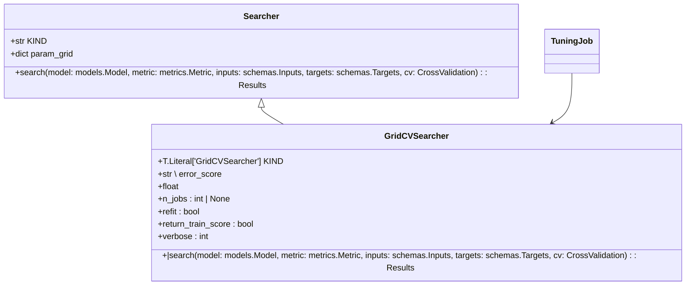

# Module Specification: Searchers

* **Source Reference:** `src/autogen_team/infrastructure/utils/searchers.py`

## UML Diagrams

```mermaid
classDiagram
    class GridCVSearcher {
        +T.Literal['GridCVSearcher'] KIND
        +str \ error_score
        +float
        +n_jobs : int \| None
        +refit : bool
        +return_train_score : bool
        +verbose : int
        +|search(model: models.Model, metric: metrics.Metric, inputs: schemas.Inputs, targets: schemas.Targets, cv: CrossValidation): Results
    }
    class Searcher {
        +str KIND
        +dict param_grid
        +search(model: models.Model, metric: metrics.Metric, inputs: schemas.Inputs, targets: schemas.Targets, cv: CrossValidation): Results
    }
    Searcher <|-- GridCVSearcher
    TuningJob --> GridCVSearcher
```
