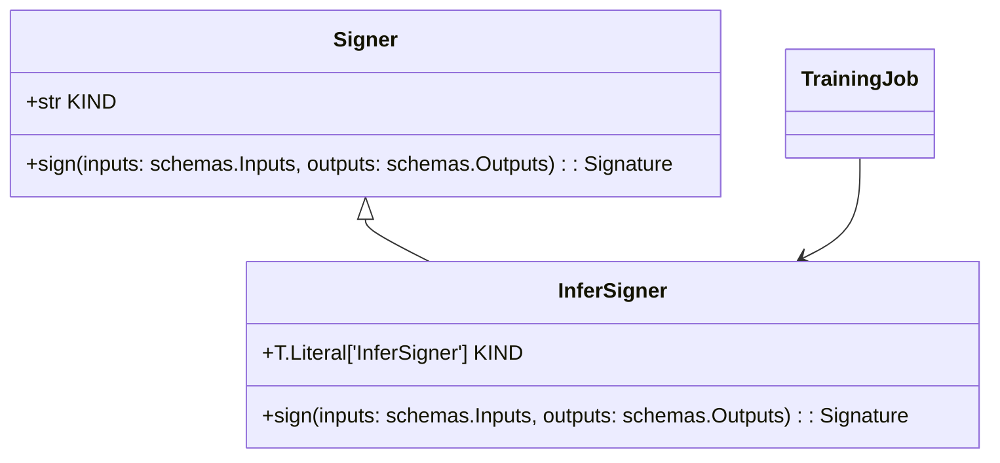

# Module Specification: Signers

* **Source Reference:** `src/autogen_team/infrastructure/utils/signers.py`

## UML Diagrams

```mermaid
classDiagram
    class InferSigner {
        +T.Literal['InferSigner'] KIND
        +sign(inputs: schemas.Inputs, outputs: schemas.Outputs): Signature
    }
    class Signer {
        +str KIND
        +sign(inputs: schemas.Inputs, outputs: schemas.Outputs): Signature
    }
    Signer <|-- InferSigner
    TrainingJob --> InferSigner
```
