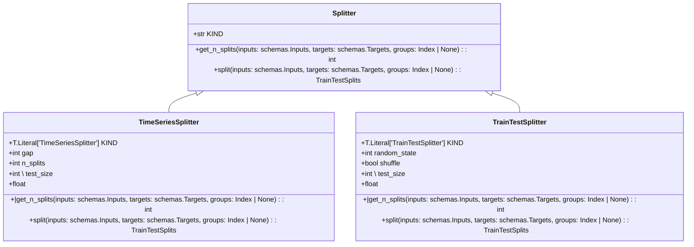

# Module Specification: Splitters

* **Source Reference:** `src/autogen_team/infrastructure/utils/splitters.py`

## UML Diagrams

```mermaid
classDiagram
    class Splitter {
        +str KIND
        +get_n_splits(inputs: schemas.Inputs, targets: schemas.Targets, groups: Index \| None): int
        +split(inputs: schemas.Inputs, targets: schemas.Targets, groups: Index \| None): TrainTestSplits
    }
    class TimeSeriesSplitter {
        +T.Literal['TimeSeriesSplitter'] KIND
        +int gap
        +int n_splits
        +int \ test_size
        +float
        +|get_n_splits(inputs: schemas.Inputs, targets: schemas.Targets, groups: Index \| None): int
        +split(inputs: schemas.Inputs, targets: schemas.Targets, groups: Index \| None): TrainTestSplits
    }
    class TrainTestSplitter {
        +T.Literal['TrainTestSplitter'] KIND
        +int random_state
        +bool shuffle
        +int \ test_size
        +float
        +|get_n_splits(inputs: schemas.Inputs, targets: schemas.Targets, groups: Index \| None): int
        +split(inputs: schemas.Inputs, targets: schemas.Targets, groups: Index \| None): TrainTestSplits
    }
    Splitter <|-- TimeSeriesSplitter
    Splitter <|-- TrainTestSplitter
```
