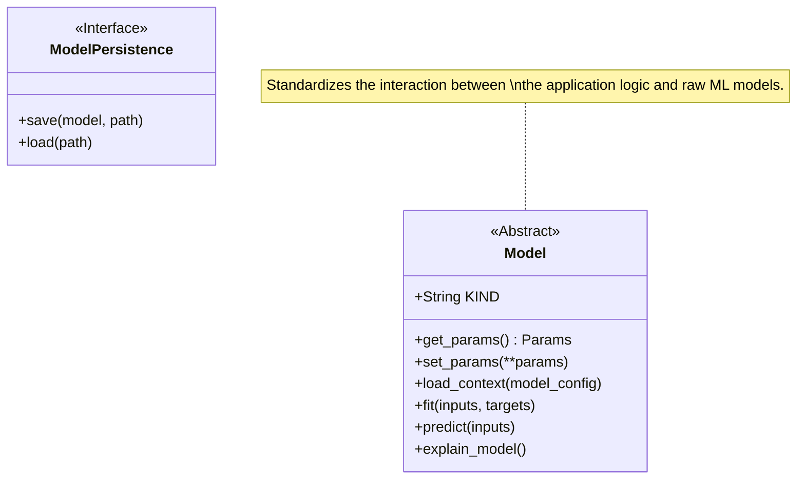

# Model Entities
The `models/entities.py` file defines the core abstraction for machine learning models within the system. It uses a contract-based approach to ensure that different AI/ML frameworks (e.g., Scikit-learn, PyTorch, TensorFlow) can be swapped interchangeably as long as they implement the required interface.

## Model Architecture
The primary abstract class `Model` enforces the lifecycle of an ML model: loading configuration, fitting on data, and producing predictions.

## Key Components:
- **`Model` (Base Class)**: 
    - Inherits from `pydantic.BaseModel` to handle validation of model configurations.
    - Implements standard methods like `get_params` and `set_params` for dynamic configuration management.
    - Defines abstract methods `load_context`, `fit`, and `predict` which must be implemented by specific models (e.g., `OpenAIModel`, `LlamaModel`).
- **`ModelRepository`**: 
    - Defined in `src/autogen_team/models/repositories.py`.
    - Provides a standard interface for persisting models to storage (File System, S3, etc.).

*Refer to:*
- *Core Schemas: `/openwiki/modules/core-schemas.md`*
- *Source File: `src/autogen_team/models/entities.py`*
