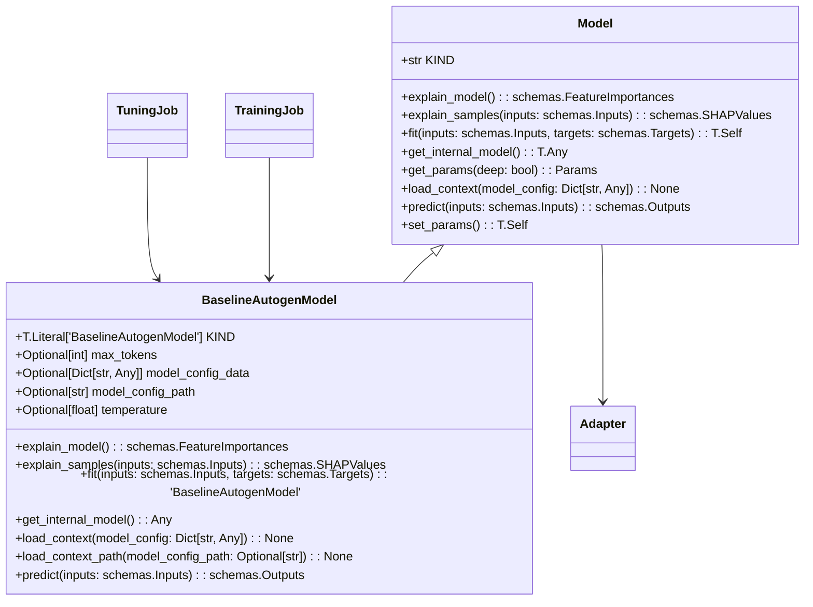

# Module Specification: Models Entities

* **Source Reference:** `src/autogen_team/models/entities.py` (Lines: L1-L413)
* **Bounded Context:** Models
* **Upstream Dependencies:** [[Modules/Core/Schemas]]

## 1. UML 2.0 Class Diagram

## 2. Abstract Model Interface (`L33-L130`)

The `Model` class serves as the pluggable model interface, compatible with scikit-learn's estimator protocol via `get_params()`/`set_params()`. 

| Method | Abstract | Purpose |
| :--- | :--- | :--- |
| `load_context(model_config)` | ✅ | Load model configuration at runtime |
| `fit(inputs, targets)` | ✅ | Train the model |
| `predict(inputs)` | ✅ | Generate predictions |
| `explain_model()` | ❌ | Return global feature importances |
| `explain_samples(inputs)` | ❌ | Return per-sample SHAP values |
| `get_internal_model()` | ❌ | Return underlying model object |

## 3. BaselineAutogenModel (`L132-L413`)

The primary model implementation, using OpenAI-compatible chat API via `autogen_ext.models.openai`:

### Configuration

| Parameter | Type | Default | Purpose |
| :--- | :--- | :--- | :--- |
| `max_tokens` | `int` | 1000 | Max generation length |
| `temperature` | `float` | 0.7 | Generation temperature |
| `agent_framework` | `str` | `"autogen"` | Agent framework selector |
| `api_base_url` | `str` | LiteLLM cluster URL | LLM API endpoint |
| `api_model` | `str` | `"minimax-m2.7:cloud"` | Model identifier |
| `api_key` | `str` | From env | API authentication |

### Key Methods

* **`load_context(model_config)`** (L199-L235): Loads config with `${VAR}` env var expansion. Initializes `OpenAIChatCompletionClient`.
* **`predict(inputs)`** (L238-L310): Processes each input row through a 2-agent group chat (UserProxyAgent + AssistantAgent). Returns Outputs DataFrame with response + metadata.
* **`_predict_single(prompt)`** (L312-L361): Async single prediction via `RoundRobinGroupChat`.
* **`_predict_batch(prompts)`** (L363-L400): Parallel batch predictions using `asyncio.gather`.

