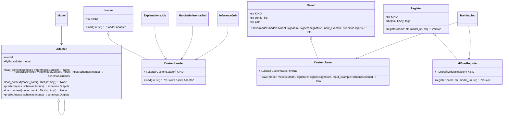

# Module Specification: Mlflow Adapter

* **Source Reference:** `src/autogen_team/registry/adapters/mlflow_adapter.py`

## UML Diagrams

```mermaid
classDiagram
    class Adapter {
        +model
        +load_context(context: PythonModelContext): None
        +predict(context: PythonModelContext, model_input: schemas.Inputs): schemas.Outputs
    }
    class Adapter {
        +load_context(model_config: Dict[str, Any]): None
        +predict(inputs: schemas.Inputs): schemas.Outputs
    }
    class Adapter {
        +PyFuncModel model
        +load_context(model_config: Dict[str, Any]): None
        +predict(inputs: schemas.Inputs): schemas.Outputs
    }
    class CustomLoader {
        +T.Literal['CustomLoader'] KIND
        +load(uri: str): 'CustomLoader.Adapter'
    }
    class CustomSaver {
        +T.Literal['CustomSaver'] KIND
        +save(model: models.Model, signature: signers.Signature, input_example: schemas.Inputs): Info
    }
    class Loader {
        +str KIND
        +load(uri: str): 'Loader.Adapter'
    }
    class MlflowRegister {
        +T.Literal['MlflowRegister'] KIND
        +register(name: str, model_uri: str): Version
    }
    class Register {
        +str KIND
        +dict[str, T.Any] tags
        +register(name: str, model_uri: str): Version
    }
    class Saver {
        +str KIND
        +str config_file
        +str path
        +save(model: models.Model, signature: signers.Signature, input_example: schemas.Inputs): Info
    }
    Loader <|-- CustomLoader
    Adapter <|-- Adapter
    Saver <|-- CustomSaver
    Register <|-- MlflowRegister
    ExplanationsJob --> CustomLoader
    HatchetInferenceJob --> CustomLoader
    InferenceJob --> CustomLoader
    TrainingJob --> CustomSaver
    TrainingJob --> MlflowRegister
    Model --> Adapter
```
