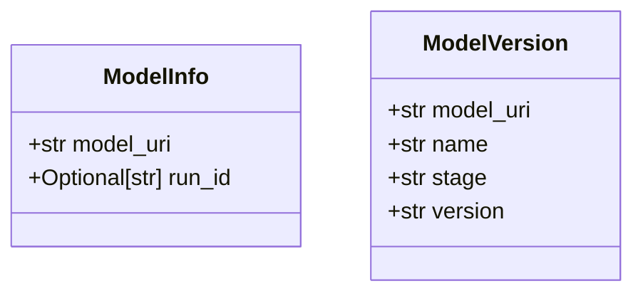

# Module Specification: Entities

* **Source Reference:** `src/autogen_team/registry/entities.py`

## UML Diagrams

```mermaid
classDiagram
    class ModelInfo {
        +str model_uri
        +Optional[str] run_id
    }
    class ModelVersion {
        +str model_uri
        +str name
        +str stage
        +str version
    }
```
