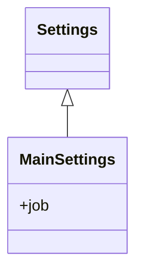

# Module Specification: Settings

* **Source Reference:** `src/autogen_team/settings.py`

## UML Diagrams

```mermaid
classDiagram
    class MainSettings {
        +job
    }
    class Settings {
    }
    Settings <|-- MainSettings
```
