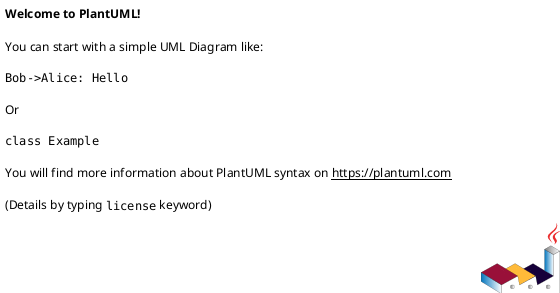
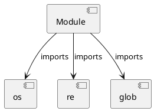

# Module Specification: convert_links

* **Source Reference:** `skills/validate/scripts/convert_links.py`

## 1. Architectural Role & Responsibilities
**Purpose:**
Provides functionality related to convert links.

**Architecture Layer:**
- Infrastructure/Other

**Responsibilities:**
- Manage and execute operations for convert_links.

**Main Workflow:**
- Initialize components and process requests for convert_links.

## 2. Dependencies
**Imports:**
- `os`
- `re`
- `glob`

**Exported Classes:**
- None

**Exported Functions:**
- `camel_to_snake`
- `resolve_wiki_link`
- `convert_file`
- `main`

## 3. Architecture & Execution
### Internal Architecture
Follows standard modular design, encapsulating state and behavior within defined classes and functions.

### Execution Flow
Sequential execution of defined functions and class methods.

### Sequence Explanation
Clients instantiate classes or call functions, which execute business logic and return results.

## 4. UML 2.0 Diagrams
### Class Diagram

### Dependency Graph

## 5. Class & Method Specifications
## 6. Module Functions
### `camel_to_snake(name: Any)`
Executes the camel_to_snake operation.

**Inputs:**
- `name`: Any

**Output:**
- Return Type: `Any`

### `resolve_wiki_link(link_content: Any, current_file_dir: Any, wiki_root: Any)`
Executes the resolve_wiki_link operation.

**Inputs:**
- `link_content`: Any
- `current_file_dir`: Any
- `wiki_root`: Any

**Output:**
- Return Type: `Any`

### `convert_file(file_path: Any, wiki_root: Any)`
Executes the convert_file operation.

**Inputs:**
- `file_path`: Any
- `wiki_root`: Any

**Output:**
- Return Type: `Any`

### `main()`
Executes the main operation.

**Inputs:**
- None

**Output:**
- Return Type: `Any`
