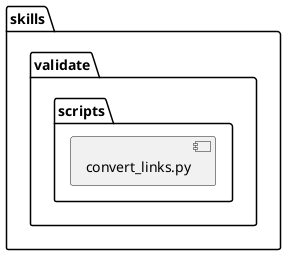
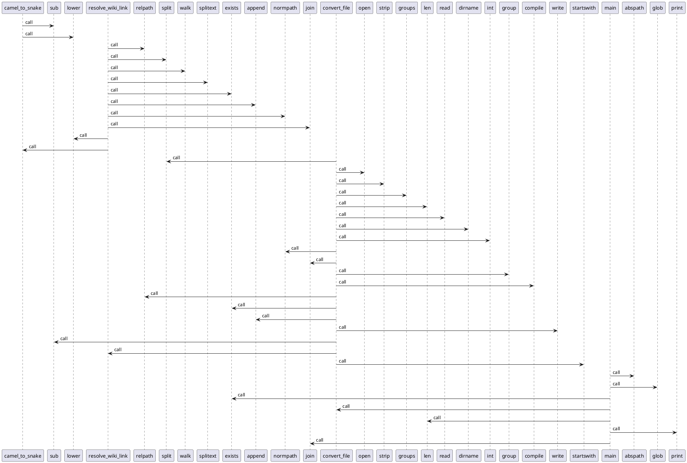
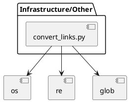
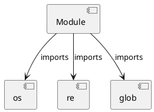

# Module Specification: convert_links

* **Source Reference:** `skills/validate/scripts/convert_links.py`

## 1. Architectural Role & Responsibilities
**Purpose:**
Provides functionality related to convert links.

**Architecture Layer:**
- Infrastructure/Other

**Responsibilities:**
- Not explicitly defined.

**Main Workflow:**
- Not explicitly defined.

## 2. Dependencies
**Imports:**
- `os`
- `re`
- `glob`

**Exported Classes:**
- None

**Exported Functions:**
- `camel_to_snake`
- `resolve_wiki_link`
- `convert_file`
- `main`

**Exported Interfaces:**
- Not explicitly defined.

**Public API:**
- Not explicitly defined.

## 3. Architecture & Execution
### Internal Architecture
Not explicitly defined.

### Execution Flow
Not explicitly defined.

### Sequence Explanation
Not explicitly defined.

### Examples
Not explicitly defined.

## 4. UML 2.0 Diagrams
### Class Diagram

```plantuml
@startuml
    ' No classes found in module
@enduml
```

### Package Diagram

```plantuml
@startuml
    package "skills" {
        package "validate" {
            package "scripts" {
                [convert_links.py]
            }
        }
    }
@enduml
```

### Sequence Diagram

```plantuml
@startuml
    camel_to_snake -> sub : call
    camel_to_snake -> lower : call
    resolve_wiki_link -> relpath : call
    resolve_wiki_link -> split : call
    resolve_wiki_link -> walk : call
    resolve_wiki_link -> splitext : call
    resolve_wiki_link -> exists : call
    resolve_wiki_link -> append : call
    resolve_wiki_link -> normpath : call
    resolve_wiki_link -> join : call
    resolve_wiki_link -> lower : call
    resolve_wiki_link -> camel_to_snake : call
    convert_file -> split : call
    convert_file -> open : call
    convert_file -> strip : call
    convert_file -> groups : call
    convert_file -> len : call
    convert_file -> read : call
    convert_file -> dirname : call
    convert_file -> int : call
    convert_file -> normpath : call
    convert_file -> join : call
    convert_file -> group : call
    convert_file -> compile : call
    convert_file -> relpath : call
    convert_file -> exists : call
    convert_file -> append : call
    convert_file -> write : call
    convert_file -> sub : call
    convert_file -> resolve_wiki_link : call
    convert_file -> startswith : call
    main -> abspath : call
    main -> glob : call
    main -> exists : call
    main -> convert_file : call
    main -> len : call
    main -> print : call
    main -> join : call
@enduml
```

### Component Diagram

```plantuml
@startuml
    package "Infrastructure/Other" {
        [convert_links.py]
    }
    [convert_links.py] --> [os]
    [convert_links.py] --> [re]
    [convert_links.py] --> [glob]
@enduml
```

### Dependency Graph

```plantuml
@startuml
    [Module] --> [os] : imports
    [Module] --> [re] : imports
    [Module] --> [glob] : imports
@enduml
```

## 5. Class & Method Specifications
## 6. Module Functions
### `camel_to_snake(name: Any) -> Any` (Public)
**Description:** No description provided.

**Inputs:**
- `name`
  - type: Any
  - meaning: Not explicitly defined.
  - valid values: Not explicitly defined.
  - optional?: False
  - default value: None

**Output:**
- return type: `Any`
- semantic meaning: Not explicitly defined.
- possible null values: Not explicitly defined.
- exceptions: Not explicitly defined.

**Side Effects:**
- Database updates: Not explicitly defined.
- File operations: Not explicitly defined.
- Network calls: Not explicitly defined.
- Cache: Not explicitly defined.
- State changes: Not explicitly defined.

**Complexity:**
- Time Complexity: Not explicitly defined.
- Space Complexity: Not explicitly defined.

**Example:**
```python
result = camel_to_snake(...)
```

### `resolve_wiki_link(link_content: Any, current_file_dir: Any, wiki_root: Any) -> Any` (Public)
**Description:** No description provided.

**Inputs:**
- `link_content`
  - type: Any
  - meaning: Not explicitly defined.
  - valid values: Not explicitly defined.
  - optional?: False
  - default value: None
- `current_file_dir`
  - type: Any
  - meaning: Not explicitly defined.
  - valid values: Not explicitly defined.
  - optional?: False
  - default value: None
- `wiki_root`
  - type: Any
  - meaning: Not explicitly defined.
  - valid values: Not explicitly defined.
  - optional?: False
  - default value: None

**Output:**
- return type: `Any`
- semantic meaning: Not explicitly defined.
- possible null values: Not explicitly defined.
- exceptions: Not explicitly defined.

**Side Effects:**
- Database updates: Not explicitly defined.
- File operations: Not explicitly defined.
- Network calls: Not explicitly defined.
- Cache: Not explicitly defined.
- State changes: Not explicitly defined.

**Complexity:**
- Time Complexity: Not explicitly defined.
- Space Complexity: Not explicitly defined.

**Example:**
```python
result = resolve_wiki_link(..., ..., ...)
```

### `convert_file(file_path: Any, wiki_root: Any) -> Any` (Public)
**Description:** No description provided.

**Inputs:**
- `file_path`
  - type: Any
  - meaning: Not explicitly defined.
  - valid values: Not explicitly defined.
  - optional?: False
  - default value: None
- `wiki_root`
  - type: Any
  - meaning: Not explicitly defined.
  - valid values: Not explicitly defined.
  - optional?: False
  - default value: None

**Output:**
- return type: `Any`
- semantic meaning: Not explicitly defined.
- possible null values: Not explicitly defined.
- exceptions: Not explicitly defined.

**Side Effects:**
- Database updates: Not explicitly defined.
- File operations: Not explicitly defined.
- Network calls: Not explicitly defined.
- Cache: Not explicitly defined.
- State changes: Not explicitly defined.

**Complexity:**
- Time Complexity: Not explicitly defined.
- Space Complexity: Not explicitly defined.

**Example:**
```python
result = convert_file(..., ...)
```

### `main() -> Any` (Public)
**Description:** No description provided.

**Inputs:**
- None

**Output:**
- return type: `Any`
- semantic meaning: Not explicitly defined.
- possible null values: Not explicitly defined.
- exceptions: Not explicitly defined.

**Side Effects:**
- Database updates: Not explicitly defined.
- File operations: Not explicitly defined.
- Network calls: Not explicitly defined.
- Cache: Not explicitly defined.
- State changes: Not explicitly defined.

**Complexity:**
- Time Complexity: Not explicitly defined.
- Space Complexity: Not explicitly defined.

**Example:**
```python
result = main()
```

## 7. Call Graph

```plantuml
@startuml
[convert_links] --> [split] : calls
[convert_links] --> [main] : calls
[convert_links] --> [glob] : calls
[convert_links] --> [open] : calls
[convert_links] --> [strip] : calls
[convert_links] --> [groups] : calls
[convert_links] --> [splitext] : calls
[convert_links] --> [len] : calls
[convert_links] --> [convert_file] : calls
[convert_links] --> [read] : calls
[convert_links] --> [dirname] : calls
[convert_links] --> [int] : calls
[convert_links] --> [normpath] : calls
[convert_links] --> [join] : calls
[convert_links] --> [group] : calls
[convert_links] --> [compile] : calls
[convert_links] --> [relpath] : calls
[convert_links] --> [exists] : calls
[convert_links] --> [append] : calls
[convert_links] --> [print] : calls
[convert_links] --> [lower] : calls
[convert_links] --> [write] : calls
[convert_links] --> [camel_to_snake] : calls
[convert_links] --> [walk] : calls
[convert_links] --> [abspath] : calls
[convert_links] --> [sub] : calls
[convert_links] --> [resolve_wiki_link] : calls
[convert_links] --> [startswith] : calls
@enduml
```

## 8. Cross References
- **Dependencies:** [Dependencies](../../../../dependencies/index.md)
- **Used by:** None
- **Calls:** split, main, glob, open, strip, groups, splitext, len, convert_file, read, dirname, int, normpath, join, group, compile, relpath, exists, append, print, lower, write, camel_to_snake, walk, abspath, sub, resolve_wiki_link, startswith
- **Called from:** ../../../tests/infrastructure/messaging/test_kafka_app.md, ../../../Scripts/test_mcp_client_simple.md, ../../../src/autogen_team/__main__.md, ../../../Scripts/run_hatchet_worker.md, ../../../tests/test_scripts.md, ../../../src/autogen_team/infrastructure/messaging/kafka_app.md, ../../../Scripts/send_kafka_test.md, ../../../tests/repro_kafka_log.md, ../../../tests/registry/adapters/test_security_mlflow_adapter.md, okf_validate.md, ../../../Scripts/verify_agent_mcp.md, ../../../Scripts/trigger_mission.md, ../../../tests/evaluation/metrics/test_metrics.md
- **Related classes:** [Classes](../../../../classes/index.md)
- **Related diagrams:** [Diagrams](../../../../diagrams/index.md)
