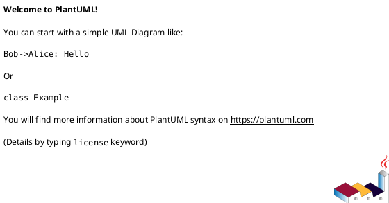
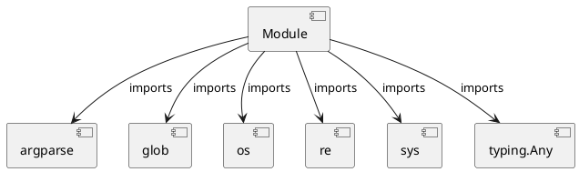

# Module Specification: okf_validate

* **Source Reference:** `skills/validate/scripts/okf_validate.py`

## 1. Architectural Role & Responsibilities
**Purpose:**
Provides functionality related to okf validate.

**Architecture Layer:**
- Infrastructure/Other

**Responsibilities:**
- Not explicitly defined.

**Main Workflow:**
- Not explicitly defined.

## 2. Dependencies
**Imports:**
- `argparse`
- `glob`
- `os`
- `re`
- `sys`
- `typing.Any`

**Exported Classes:**
- None

**Exported Functions:**
- `extract_frontmatter`
- `check_frontmatter_fields`
- `check_absolute_paths`
- `check_mermaid_syntax`
- `validate_wiki`
- `main`

## 3. Architecture & Execution
### Internal Architecture
Not explicitly defined.

### Execution Flow
Not explicitly defined.

### Sequence Explanation
Not explicitly defined.

## 4. UML 2.0 Diagrams
### Class Diagram

### Dependency Graph

## 5. Class & Method Specifications
## 6. Module Functions
### `extract_frontmatter(content: str)`
Split YAML frontmatter from Markdown body.

**Inputs:**
- `content`: str

**Output:**
- Return Type: `tuple[dict[str, Any], str]`

### `check_frontmatter_fields(fm: dict[str, Any], filepath: str, strict: bool)`
Validate required and optional frontmatter fields.

**Inputs:**
- `fm`: dict[str, Any]
- `filepath`: str
- `strict`: bool

**Output:**
- Return Type: `list[str]`

### `check_absolute_paths(body: str, filepath: str)`
Detect absolute file paths in the document body.

**Inputs:**
- `body`: str
- `filepath`: str

**Output:**
- Return Type: `list[str]`

### `check_mermaid_syntax(body: str, filepath: str)`
Basic structural validation of Mermaid code blocks.

**Inputs:**
- `body`: str
- `filepath`: str

**Output:**
- Return Type: `list[str]`

### `validate_wiki(wiki_path: str, strict: bool)`
Validate all .md files under wiki_path. Returns error count.

**Inputs:**
- `wiki_path`: str
- `strict`: bool

**Output:**
- Return Type: `int`

### `main()`
No description provided.

**Inputs:**
- None

**Output:**
- Return Type: `None`
