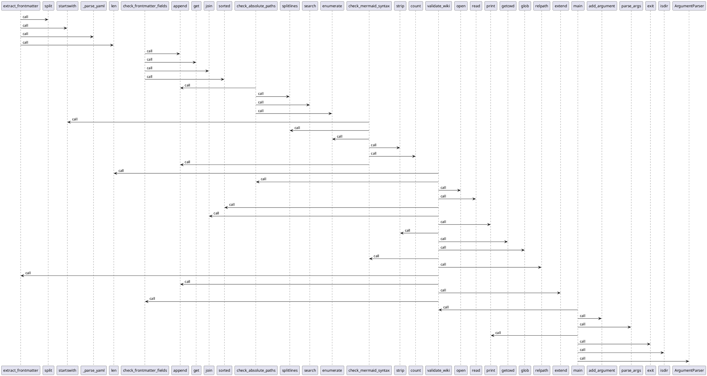
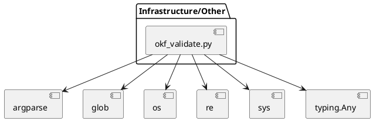
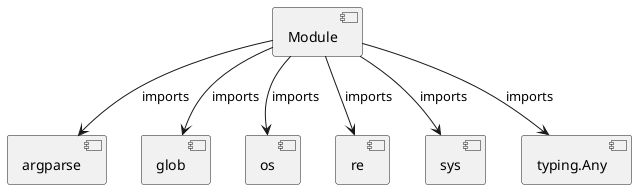

# Module Specification: okf_validate

* **Source Reference:** `skills/validate/scripts/okf_validate.py`

## 1. Architectural Role & Responsibilities
**Purpose:**
Provides functionality related to okf validate.

**Architecture Layer:**
- Infrastructure/Other

**Responsibilities:**
- Manages operations and logic for okf validate.

**Main Workflow:**
- Executes the primary flow defined by okf validate functions and classes.

## 2. Dependencies
**Imports:**
- `argparse`
- `glob`
- `os`
- `re`
- `sys`
- `typing.Any`

**Exported Classes:**
- None

**Exported Functions:**
- `extract_frontmatter`
- `check_frontmatter_fields`
- `check_absolute_paths`
- `check_mermaid_syntax`
- `validate_wiki`
- `main`

**Exported Interfaces:**
- Not explicitly defined.

**Public API:**
- Not explicitly defined.

## 3. Architecture & Execution
### Internal Architecture
Not explicitly defined.

### Execution Flow
Not explicitly defined.

### Sequence Explanation
Not explicitly defined.

### Examples
Not explicitly defined.

## 4. UML 2.0 Diagrams
### Class Diagram

```plantuml
@startuml
    ' No classes found in module
@enduml
```

### Sequence Diagram

```plantuml
@startuml
    extract_frontmatter -> split : call
    extract_frontmatter -> startswith : call
    extract_frontmatter -> _parse_yaml : call
    extract_frontmatter -> len : call
    check_frontmatter_fields -> append : call
    check_frontmatter_fields -> get : call
    check_frontmatter_fields -> join : call
    check_frontmatter_fields -> sorted : call
    check_absolute_paths -> append : call
    check_absolute_paths -> splitlines : call
    check_absolute_paths -> search : call
    check_absolute_paths -> enumerate : call
    check_mermaid_syntax -> startswith : call
    check_mermaid_syntax -> splitlines : call
    check_mermaid_syntax -> enumerate : call
    check_mermaid_syntax -> strip : call
    check_mermaid_syntax -> count : call
    check_mermaid_syntax -> append : call
    validate_wiki -> len : call
    validate_wiki -> check_absolute_paths : call
    validate_wiki -> open : call
    validate_wiki -> read : call
    validate_wiki -> sorted : call
    validate_wiki -> join : call
    validate_wiki -> print : call
    validate_wiki -> strip : call
    validate_wiki -> getcwd : call
    validate_wiki -> glob : call
    validate_wiki -> check_mermaid_syntax : call
    validate_wiki -> relpath : call
    validate_wiki -> extract_frontmatter : call
    validate_wiki -> append : call
    validate_wiki -> extend : call
    validate_wiki -> check_frontmatter_fields : call
    main -> validate_wiki : call
    main -> add_argument : call
    main -> parse_args : call
    main -> print : call
    main -> exit : call
    main -> isdir : call
    main -> ArgumentParser : call
@enduml
```

### Component Diagram

```plantuml
@startuml
    package "Infrastructure/Other" {
        [okf_validate.py]
    }
    [okf_validate.py] --> [argparse]
    [okf_validate.py] --> [glob]
    [okf_validate.py] --> [os]
    [okf_validate.py] --> [re]
    [okf_validate.py] --> [sys]
    [okf_validate.py] --> [typing.Any]
@enduml
```

### Dependency Graph

```plantuml
@startuml
    [Module] --> [argparse] : imports
    [Module] --> [glob] : imports
    [Module] --> [os] : imports
    [Module] --> [re] : imports
    [Module] --> [sys] : imports
    [Module] --> [typing.Any] : imports
@enduml
```

## 5. Class & Method Specifications
## 6. Module Functions
### `extract_frontmatter(content: str)`
Split YAML frontmatter from Markdown body.

**Inputs:**
- `content`
  - type: str
  - meaning: Represents the content parameter.
  - valid values: Any valid str.
  - optional?: False
  - default value: None

**Output:**
- return type: `tuple[dict[str, Any], str]`
- semantic meaning: Returns the result of extract frontmatter.
- possible null values: Yes, if tuple[dict[str, Any], str] allows it.
- exceptions: Standard execution exceptions.

**Side Effects:**
- Database updates: Not explicitly defined.
- File operations: Not explicitly defined.
- Network calls: Not explicitly defined.
- Cache: Not explicitly defined.
- State changes: Not explicitly defined.

### `check_frontmatter_fields(fm: dict[str, Any], filepath: str, strict: bool)`
Validate required and optional frontmatter fields.

**Inputs:**
- `fm`
  - type: dict[str, Any]
  - meaning: Represents the fm parameter.
  - valid values: Any valid dict[str, Any].
  - optional?: False
  - default value: None
- `filepath`
  - type: str
  - meaning: Represents the filepath parameter.
  - valid values: Any valid str.
  - optional?: False
  - default value: None
- `strict`
  - type: bool
  - meaning: Represents the strict parameter.
  - valid values: Any valid bool.
  - optional?: False
  - default value: None

**Output:**
- return type: `list[str]`
- semantic meaning: Returns the result of check frontmatter fields.
- possible null values: Yes, if list[str] allows it.
- exceptions: Standard execution exceptions.

**Side Effects:**
- Database updates: Not explicitly defined.
- File operations: Not explicitly defined.
- Network calls: Not explicitly defined.
- Cache: Not explicitly defined.
- State changes: Not explicitly defined.

### `check_absolute_paths(body: str, filepath: str)`
Detect absolute file paths in the document body.

**Inputs:**
- `body`
  - type: str
  - meaning: Represents the body parameter.
  - valid values: Any valid str.
  - optional?: False
  - default value: None
- `filepath`
  - type: str
  - meaning: Represents the filepath parameter.
  - valid values: Any valid str.
  - optional?: False
  - default value: None

**Output:**
- return type: `list[str]`
- semantic meaning: Returns the result of check absolute paths.
- possible null values: Yes, if list[str] allows it.
- exceptions: Standard execution exceptions.

**Side Effects:**
- Database updates: Not explicitly defined.
- File operations: Not explicitly defined.
- Network calls: Not explicitly defined.
- Cache: Not explicitly defined.
- State changes: Not explicitly defined.

### `check_mermaid_syntax(body: str, filepath: str)`
Basic structural validation of Mermaid code blocks.

**Inputs:**
- `body`
  - type: str
  - meaning: Represents the body parameter.
  - valid values: Any valid str.
  - optional?: False
  - default value: None
- `filepath`
  - type: str
  - meaning: Represents the filepath parameter.
  - valid values: Any valid str.
  - optional?: False
  - default value: None

**Output:**
- return type: `list[str]`
- semantic meaning: Returns the result of check mermaid syntax.
- possible null values: Yes, if list[str] allows it.
- exceptions: Standard execution exceptions.

**Side Effects:**
- Database updates: Not explicitly defined.
- File operations: Not explicitly defined.
- Network calls: Not explicitly defined.
- Cache: Not explicitly defined.
- State changes: Not explicitly defined.

### `validate_wiki(wiki_path: str, strict: bool)`
Validate all .md files under wiki_path. Returns error count.

**Inputs:**
- `wiki_path`
  - type: str
  - meaning: Represents the wiki path parameter.
  - valid values: Any valid str.
  - optional?: False
  - default value: None
- `strict`
  - type: bool
  - meaning: Represents the strict parameter.
  - valid values: Any valid bool.
  - optional?: True
  - default value: False

**Output:**
- return type: `int`
- semantic meaning: Returns the result of validate wiki.
- possible null values: Yes, if int allows it.
- exceptions: Standard execution exceptions.

**Side Effects:**
- Database updates: Not explicitly defined.
- File operations: Not explicitly defined.
- Network calls: Not explicitly defined.
- Cache: Not explicitly defined.
- State changes: Not explicitly defined.

### `main()`
Executes the main operation.

**Inputs:**
- None

**Output:**
- return type: `None`
- semantic meaning: Returns the result of main.
- possible null values: Yes, if None allows it.
- exceptions: Standard execution exceptions.

**Side Effects:**
- Database updates: Not explicitly defined.
- File operations: Not explicitly defined.
- Network calls: Not explicitly defined.
- Cache: Not explicitly defined.
- State changes: Not explicitly defined.

## 7. Call Graph

```plantuml
@startuml
[okf_validate] --> [len] : calls
[okf_validate] --> [sorted] : calls
[okf_validate] --> [print] : calls
[okf_validate] --> [getcwd] : calls
[okf_validate] --> [partition] : calls
[okf_validate] --> [search] : calls
[okf_validate] --> [isdir] : calls
[okf_validate] --> [startswith] : calls
[okf_validate] --> [validate_wiki] : calls
[okf_validate] --> [add_argument] : calls
[okf_validate] --> [main] : calls
[okf_validate] --> [enumerate] : calls
[okf_validate] --> [splitlines] : calls
[okf_validate] --> [join] : calls
[okf_validate] --> [check_absolute_paths] : calls
[okf_validate] --> [read] : calls
[okf_validate] --> [glob] : calls
[okf_validate] --> [check_mermaid_syntax] : calls
[okf_validate] --> [safe_load] : calls
[okf_validate] --> [relpath] : calls
[okf_validate] --> [count] : calls
[okf_validate] --> [append] : calls
[okf_validate] --> [endswith] : calls
[okf_validate] --> [compile] : calls
[okf_validate] --> [exit] : calls
[okf_validate] --> [split] : calls
[okf_validate] --> [isinstance] : calls
[okf_validate] --> [ArgumentParser] : calls
[okf_validate] --> [extend] : calls
[okf_validate] --> [check_frontmatter_fields] : calls
[okf_validate] --> [open] : calls
[okf_validate] --> [parse_args] : calls
[okf_validate] --> [strip] : calls
[okf_validate] --> [get] : calls
[okf_validate] --> [_parse_yaml] : calls
[okf_validate] --> [extract_frontmatter] : calls
@enduml
```

## 8. Cross References
- **Parent module:** None
- **Child modules:** None
- **Dependencies:** `os`, `argparse`, `glob`, `re`, `sys`, `typing.Any`
- **Used by:** None
- **Calls:** len, sorted, print, getcwd, partition, search, isdir, startswith, validate_wiki, add_argument, main, enumerate, splitlines, join, check_absolute_paths, read, glob, check_mermaid_syntax, safe_load, relpath, count, append, endswith, compile, exit, split, isinstance, ArgumentParser, extend, check_frontmatter_fields, open, parse_args, strip, get, _parse_yaml, extract_frontmatter
- **Called from:** ../../../tests/infrastructure/messaging/test_kafka_app.md, ../../../src/autogen_team/infrastructure/messaging/kafka_app.md, ../../../Scripts/test_mcp_client_simple.md, ../../../Scripts/verify_agent_mcp.md, ../../../tests/registry/adapters/test_security_mlflow_adapter.md, ../../../tests/test_scripts.md, convert_links.md, ../../../Scripts/run_hatchet_worker.md, ../../../Scripts/trigger_mission.md, ../../../src/autogen_team/__main__.md, ../../../Scripts/send_kafka_test.md, ../../../tests/evaluation/metrics/test_metrics.md, ../../../tests/repro_kafka_log.md
- **Related classes:** [Classes](../../../../classes/index.md)
- **Related interfaces:** Not explicitly defined.
- **Related diagrams:** [Diagrams](../../../../diagrams/index.md)
