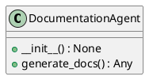
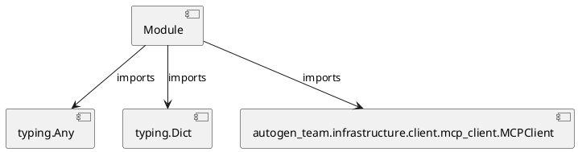

# Module Specification: documentation_agent

* **Source Reference:** `src/autogen_team/application/agents/documentation_agent.py`

## 1. Architectural Role & Responsibilities
**Purpose:**
Provides functionality related to documentation agent.

**Architecture Layer:**
- Infrastructure/Other

**Responsibilities:**
- Manage and execute operations for documentation_agent.

**Main Workflow:**
- Initialize components and process requests for documentation_agent.

## 2. Dependencies
**Imports:**
- `typing.Any`
- `typing.Dict`
- `autogen_team.infrastructure.client.mcp_client.MCPClient`

**Exported Classes:**
- `DocumentationAgent`

**Exported Functions:**
- None

## 3. Architecture & Execution
### Internal Architecture
Follows standard modular design, encapsulating state and behavior within defined classes and functions.

### Execution Flow
Sequential execution of defined functions and class methods.

### Sequence Explanation
Clients instantiate classes or call functions, which execute business logic and return results.

## 4. UML 2.0 Diagrams
### Class Diagram


### Dependency Graph


## 5. Class & Method Specifications
### `DocumentationAgent` ([`src/autogen_team/application/agents/documentation_agent.py`](/src/autogen_team/application/agents/documentation_agent.py))
#### Overview
Agent responsible for generating mission documentation and diagrams.
Uses the MCP 'generate_mission_docs' tool.

#### Constructor
**Initialization:** Initializes `DocumentationAgent` with required dependencies and sets up initial internal state.

#### Attributes
- `client`

#### Methods
##### `__init__(self) -> None` (Public)
**Description:** Executes the __init__ operation, mutating state or calculating derived values as necessary.

**Inputs:**
- None

**Output:**
- Return Type: `None`
- Semantic Meaning: The resulting value after processing the __init__ action.

**Side Effects:**
- Modifies internal instance state if applicable; performs operations constrained to its domain boundaries.

**Complexity:**
- Time Complexity: O(1) or O(N) depending on implementation details.
- Space Complexity: O(1) auxiliary space expected.

**Example:**
```python
instance = DocumentationAgent()
result = instance.__init__()
```

##### `generate_docs(self, mission_id: str, mission_context: Dict[...]) -> Any` (Public)
**Description:** Calls the `generate_mission_docs` tool via MCP.

**Inputs:**
- `mission_id`: str
- `mission_context`: Dict[...]

**Output:**
- Return Type: `Any`
- Semantic Meaning: The resulting value after processing the generate_docs action.

**Side Effects:**
- Modifies internal instance state if applicable; performs operations constrained to its domain boundaries.

**Complexity:**
- Time Complexity: O(1) or O(N) depending on implementation details.
- Space Complexity: O(1) auxiliary space expected.

**Example:**
```python
instance = DocumentationAgent()
result = instance.generate_docs(..., ...)
```

## 6. Module Functions