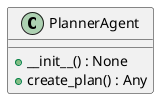
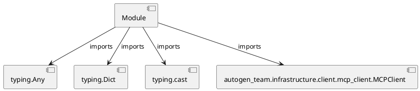

# Module Specification: planner_agent

* **Source Reference:** `src/autogen_team/application/agents/planner_agent.py`

## 1. Architectural Role & Responsibilities
**Purpose:**
Provides functionality related to planner agent.

**Architecture Layer:**
- Infrastructure/Other

**Responsibilities:**
- Manage and execute operations for planner_agent.

**Main Workflow:**
- Initialize components and process requests for planner_agent.

## 2. Dependencies
**Imports:**
- `typing.Any`
- `typing.Dict`
- `typing.cast`
- `autogen_team.infrastructure.client.mcp_client.MCPClient`

**Exported Classes:**
- `PlannerAgent`

**Exported Functions:**
- None

## 3. Architecture & Execution
### Internal Architecture
Follows standard modular design, encapsulating state and behavior within defined classes and functions.

### Execution Flow
Sequential execution of defined functions and class methods.

### Sequence Explanation
Clients instantiate classes or call functions, which execute business logic and return results.

## 4. UML 2.0 Diagrams
### Class Diagram


### Dependency Graph


## 5. Class & Method Specifications
### `PlannerAgent` ([`src/autogen_team/application/agents/planner_agent.py`](/src/autogen_team/application/agents/planner_agent.py))
#### Overview
Agent responsible for decomposing a high-level goal into a detailed plan.
Uses the MCP 'plan_mission' tool.

#### Constructor
**Initialization:** Initializes `PlannerAgent` with required dependencies and sets up initial internal state.

#### Attributes
- `client`

#### Methods
##### `__init__(self) -> None` (Public)
**Description:** Executes the __init__ operation, mutating state or calculating derived values as necessary.

**Inputs:**
- None

**Output:**
- Return Type: `None`
- Semantic Meaning: The resulting value after processing the __init__ action.

**Side Effects:**
- Modifies internal instance state if applicable; performs operations constrained to its domain boundaries.

**Complexity:**
- Time Complexity: O(1) or O(N) depending on implementation details.
- Space Complexity: O(1) auxiliary space expected.

**Example:**
```python
instance = PlannerAgent()
result = instance.__init__()
```

##### `create_plan(self, goal: str, repository_path: str) -> Any` (Public)
**Description:** Calls the `plan_mission` tool via MCP.

**Inputs:**
- `goal`: str
- `repository_path`: str

**Output:**
- Return Type: `Any`
- Semantic Meaning: The resulting value after processing the create_plan action.

**Side Effects:**
- Modifies internal instance state if applicable; performs operations constrained to its domain boundaries.

**Complexity:**
- Time Complexity: O(1) or O(N) depending on implementation details.
- Space Complexity: O(1) auxiliary space expected.

**Example:**
```python
instance = PlannerAgent()
result = instance.create_plan(..., ...)
```

## 6. Module Functions