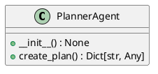
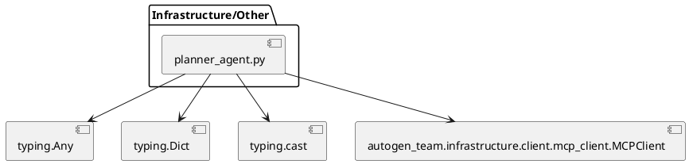
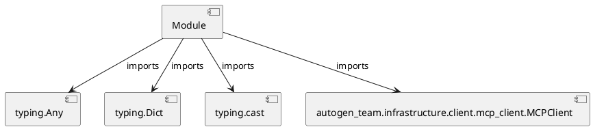
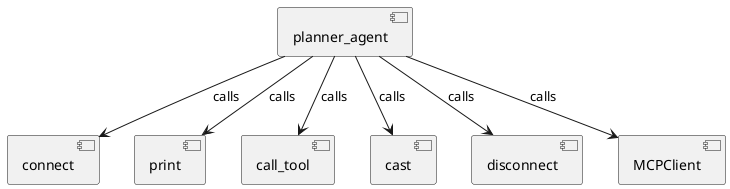

# Module Specification: planner_agent

* **Source Reference:** `src/autogen_team/application/agents/planner_agent.py`

## 1. Architectural Role & Responsibilities
**Purpose:**
Provides functionality related to planner agent.

**Architecture Layer:**
- Infrastructure/Other

**Responsibilities:**
- Manages operations and logic for planner agent.

**Main Workflow:**
- Executes the primary flow defined by planner agent functions and classes.

## 2. Dependencies
**Imports:**
- `typing.Any`
- `typing.Dict`
- `typing.cast`
- `autogen_team.infrastructure.client.mcp_client.MCPClient`

**Exported Classes:**
- `PlannerAgent`

**Exported Functions:**
- None

**Exported Interfaces:**
- Not explicitly defined.

**Public API:**
- Not explicitly defined.

## 3. Architecture & Execution
### Internal Architecture
Not explicitly defined.

### Execution Flow
Not explicitly defined.

### Sequence Explanation
Not explicitly defined.

### Examples
Not explicitly defined.

## 4. UML 2.0 Diagrams
### Class Diagram

```plantuml
@startuml
    class PlannerAgent {
        +__init__() : None
        +create_plan() : Dict[str, Any]
    }
@enduml
```

### Sequence Diagram

```plantuml
@startuml
    ' No functions for sequence
@enduml
```

### Component Diagram

```plantuml
@startuml
    package "Infrastructure/Other" {
        [planner_agent.py]
    }
    [planner_agent.py] --> [typing.Any]
    [planner_agent.py] --> [typing.Dict]
    [planner_agent.py] --> [typing.cast]
    [planner_agent.py] --> [autogen_team.infrastructure.client.mcp_client.MCPClient]
@enduml
```

### Dependency Graph

```plantuml
@startuml
    [Module] --> [typing.Any] : imports
    [Module] --> [typing.Dict] : imports
    [Module] --> [typing.cast] : imports
    [Module] --> [autogen_team.infrastructure.client.mcp_client.MCPClient] : imports
@enduml
```

## 5. Class & Method Specifications
### `PlannerAgent` ([`src/autogen_team/application/agents/planner_agent.py`](/src/autogen_team/application/agents/planner_agent.py))
#### Overview
Agent responsible for decomposing a high-level goal into a detailed plan.
Uses the MCP 'plan_mission' tool.

#### Constructor
**Initialization:** Initializes `PlannerAgent` with required dependencies and sets up initial internal state.

#### Attributes
- `client`
  - Type: Any
  - Purpose: Represents the client property.
  - Constraints: Not explicitly defined.

#### Methods
##### `__init__(self) -> None` (Public)
**Description:** Executes the   init   operation.

**Inputs:**
- None

**Output:**
- return type: `None`
- semantic meaning: Returns the result of   init  .
- possible null values: Yes, if None allows it.
- exceptions: Standard execution exceptions.

**Side Effects:**
- Database updates: Not explicitly defined.
- File operations: Not explicitly defined.
- Network calls: Not explicitly defined.
- Cache: Not explicitly defined.
- State changes: Not explicitly defined.

**Complexity:**
- Time Complexity: Not explicitly defined.
- Space Complexity: Not explicitly defined.

**Example:**
```python
instance = PlannerAgent()
result = instance.__init__()
```

##### `create_plan(self, goal: str, repository_path: str) -> Dict[str, Any]` (Public)
**Description:** Calls the `plan_mission` tool via MCP.

**Inputs:**
- `goal`
  - type: str
  - meaning: Represents the goal parameter.
  - valid values: Any valid str.
  - optional?: False
  - default value: None
- `repository_path`
  - type: str
  - meaning: Represents the repository path parameter.
  - valid values: Any valid str.
  - optional?: False
  - default value: None

**Output:**
- return type: `Dict[str, Any]`
- semantic meaning: Returns the result of create plan.
- possible null values: Yes, if Dict[str, Any] allows it.
- exceptions: Standard execution exceptions.

**Side Effects:**
- Database updates: Not explicitly defined.
- File operations: Not explicitly defined.
- Network calls: Not explicitly defined.
- Cache: Not explicitly defined.
- State changes: Not explicitly defined.

**Complexity:**
- Time Complexity: Not explicitly defined.
- Space Complexity: Not explicitly defined.

**Example:**
```python
instance = PlannerAgent()
result = instance.create_plan(..., ...)
```

## 6. Module Functions
## 7. Call Graph

```plantuml
@startuml
[planner_agent] --> [connect] : calls
[planner_agent] --> [print] : calls
[planner_agent] --> [call_tool] : calls
[planner_agent] --> [cast] : calls
[planner_agent] --> [disconnect] : calls
[planner_agent] --> [MCPClient] : calls
@enduml
```

## 8. Cross References
- **Parent module:** None
- **Child modules:** None
- **Dependencies:** `typing.Dict`, `typing.cast`, `typing.Any`, `autogen_team.infrastructure.client.mcp_client.MCPClient`
- **Used by:** ../workflows/autonomous_mission.md, ../../../../Scripts/verify_agent_mcp.md, ../../../../tests/application/agents/test_agents.md
- **Calls:** connect, print, call_tool, cast, disconnect, MCPClient
- **Called from:** None
- **Related classes:** [Classes](../../../../../classes/index.md)
- **Related interfaces:** Not explicitly defined.
- **Related diagrams:** [Diagrams](../../../../../diagrams/index.md)
