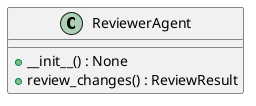
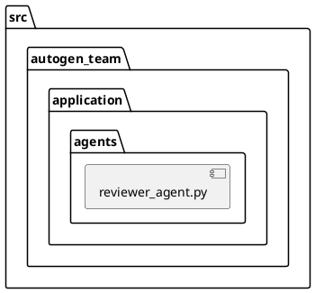
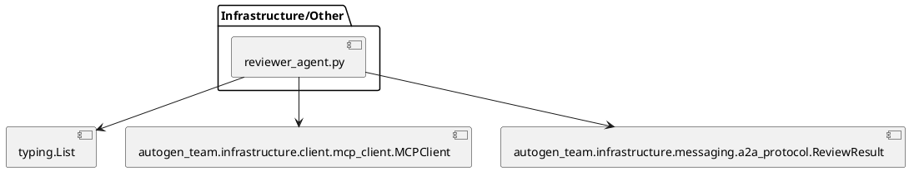
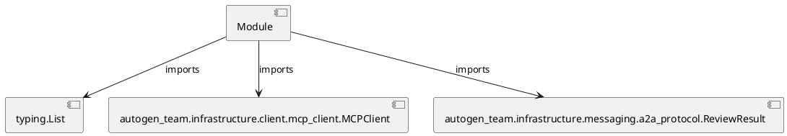
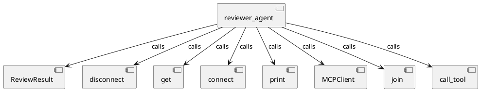

# Module Specification: reviewer_agent

* **Source Reference:** `src/autogen_team/application/agents/reviewer_agent.py`

## 1. Architectural Role & Responsibilities
**Purpose:**
Provides functionality related to reviewer agent.

**Architecture Layer:**
- Infrastructure/Other

**Responsibilities:**
- Not explicitly defined.

**Main Workflow:**
- Not explicitly defined.

## 2. Dependencies
**Imports:**
- `typing.List`
- `autogen_team.infrastructure.client.mcp_client.MCPClient`
- `autogen_team.infrastructure.messaging.a2a_protocol.ReviewResult`

**Exported Classes:**
- `ReviewerAgent`

**Exported Functions:**
- None

**Exported Interfaces:**
- Not explicitly defined.

**Public API:**
- Not explicitly defined.

## 3. Architecture & Execution
### Internal Architecture
Not explicitly defined.

### Execution Flow
Not explicitly defined.

### Sequence Explanation
Not explicitly defined.

### Examples
Not explicitly defined.

## 4. UML 2.0 Diagrams
### Class Diagram

```plantuml
@startuml
    class ReviewerAgent {
        +__init__() : None
        +review_changes() : ReviewResult
    }
@enduml
```

### Package Diagram

```plantuml
@startuml
    package "src" {
        package "autogen_team" {
            package "application" {
                package "agents" {
                    [reviewer_agent.py]
                }
            }
        }
    }
@enduml
```

### Sequence Diagram

```plantuml
@startuml
    ' No functions for sequence
@enduml
```

### Component Diagram

```plantuml
@startuml
    package "Infrastructure/Other" {
        [reviewer_agent.py]
    }
    [reviewer_agent.py] --> [typing.List]
    [reviewer_agent.py] --> [autogen_team.infrastructure.client.mcp_client.MCPClient]
    [reviewer_agent.py] --> [autogen_team.infrastructure.messaging.a2a_protocol.ReviewResult]
@enduml
```

### Dependency Graph

```plantuml
@startuml
    [Module] --> [typing.List] : imports
    [Module] --> [autogen_team.infrastructure.client.mcp_client.MCPClient] : imports
    [Module] --> [autogen_team.infrastructure.messaging.a2a_protocol.ReviewResult] : imports
@enduml
```

## 5. Class & Method Specifications
### `ReviewerAgent` ([`src/autogen_team/application/agents/reviewer_agent.py`](/src/autogen_team/application/agents/reviewer_agent.py))
#### Overview
Agent responsible for reviewing code changes.
Uses the MCP 'security_review' tool.

#### Constructor
**Initialization:** Initializes `ReviewerAgent` with required dependencies and sets up initial internal state.

#### Attributes
- `client`
  - Type: Any
  - Purpose: Not explicitly defined.
  - Constraints: Not explicitly defined.

#### Methods
##### `__init__(self) -> None` (Public)
**Description:** No description provided.

**Inputs:**
- None

**Output:**
- return type: `None`
- semantic meaning: Not explicitly defined.
- possible null values: Not explicitly defined.
- exceptions: Not explicitly defined.

**Side Effects:**
- Database updates: Not explicitly defined.
- File operations: Not explicitly defined.
- Network calls: Not explicitly defined.
- Cache: Not explicitly defined.
- State changes: Not explicitly defined.

**Complexity:**
- Time Complexity: Not explicitly defined.
- Space Complexity: Not explicitly defined.

**Example:**
```python
instance = ReviewerAgent()
result = instance.__init__()
```

##### `review_changes(self, mission_id: str, file_changes: List[str]) -> ReviewResult` (Public)
**Description:** Calls the `security_review` tool via MCP.

**Inputs:**
- `mission_id`
  - type: str
  - meaning: Not explicitly defined.
  - valid values: Not explicitly defined.
  - optional?: False
  - default value: None
- `file_changes`
  - type: List[str]
  - meaning: Not explicitly defined.
  - valid values: Not explicitly defined.
  - optional?: False
  - default value: None

**Output:**
- return type: `ReviewResult`
- semantic meaning: Not explicitly defined.
- possible null values: Not explicitly defined.
- exceptions: Not explicitly defined.

**Side Effects:**
- Database updates: Not explicitly defined.
- File operations: Not explicitly defined.
- Network calls: Not explicitly defined.
- Cache: Not explicitly defined.
- State changes: Not explicitly defined.

**Complexity:**
- Time Complexity: Not explicitly defined.
- Space Complexity: Not explicitly defined.

**Example:**
```python
instance = ReviewerAgent()
result = instance.review_changes(..., ...)
```

## 6. Module Functions
## 7. Call Graph

```plantuml
@startuml
[reviewer_agent] --> [ReviewResult] : calls
[reviewer_agent] --> [disconnect] : calls
[reviewer_agent] --> [get] : calls
[reviewer_agent] --> [connect] : calls
[reviewer_agent] --> [print] : calls
[reviewer_agent] --> [MCPClient] : calls
[reviewer_agent] --> [join] : calls
[reviewer_agent] --> [call_tool] : calls
@enduml
```

## 8. Cross References
- **Dependencies:** [Dependencies](../../../../../dependencies/index.md)
- **Used by:** ../../../../tests/application/agents/test_agents.md, ../workflows/autonomous_mission.md, ../../../../Scripts/verify_agent_mcp.md
- **Calls:** ReviewResult, disconnect, get, connect, print, MCPClient, join, call_tool
- **Called from:** None
- **Related classes:** [Classes](../../../../../classes/index.md)
- **Related diagrams:** [Diagrams](../../../../../diagrams/index.md)
