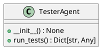
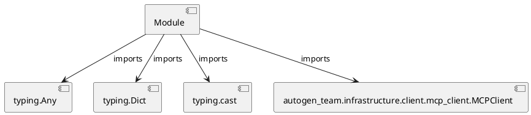

# Module Specification: tester_agent

* **Source Reference:** `src/autogen_team/application/agents/tester_agent.py`

## 1. Architectural Role & Responsibilities
**Purpose:**
Provides functionality related to tester agent.

**Architecture Layer:**
- Infrastructure/Other

**Responsibilities:**
- Not explicitly defined.

**Main Workflow:**
- Not explicitly defined.

## 2. Dependencies
**Imports:**
- `typing.Any`
- `typing.Dict`
- `typing.cast`
- `autogen_team.infrastructure.client.mcp_client.MCPClient`

**Exported Classes:**
- `TesterAgent`

**Exported Functions:**
- None

## 3. Architecture & Execution
### Internal Architecture
Not explicitly defined.

### Execution Flow
Not explicitly defined.

### Sequence Explanation
Not explicitly defined.

## 4. UML 2.0 Diagrams
### Class Diagram


### Dependency Graph


## 5. Class & Method Specifications
### `TesterAgent` ([`src/autogen_team/application/agents/tester_agent.py`](/src/autogen_team/application/agents/tester_agent.py))
#### Overview
Agent responsible for running tests.
Uses the MCP 'run_tests' tool.

#### Constructor
**Initialization:** Initializes `TesterAgent` with required dependencies and sets up initial internal state.

#### Attributes
- `client`

#### Methods
##### `__init__(self) -> None` (Public)
**Description:** No description provided.

**Inputs:**
- None

**Output:**
- Return Type: `None`
- Semantic Meaning: Not explicitly defined.

**Side Effects:**
- Not explicitly defined.

**Complexity:**
- Time Complexity: Not explicitly defined.
- Space Complexity: Not explicitly defined.

**Example:**
```python
instance = TesterAgent()
result = instance.__init__()
```

##### `run_tests(self) -> Dict[str, Any]` (Public)
**Description:** No description provided.

**Inputs:**
- None

**Output:**
- Return Type: `Dict[str, Any]`
- Semantic Meaning: Not explicitly defined.

**Side Effects:**
- Not explicitly defined.

**Complexity:**
- Time Complexity: Not explicitly defined.
- Space Complexity: Not explicitly defined.

**Example:**
```python
instance = TesterAgent()
result = instance.run_tests()
```

## 6. Module Functions