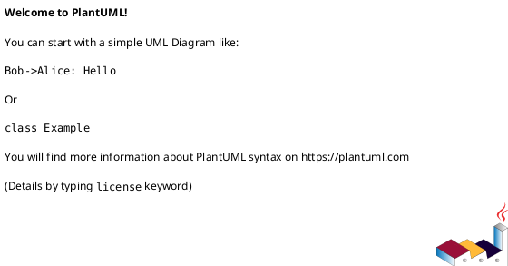
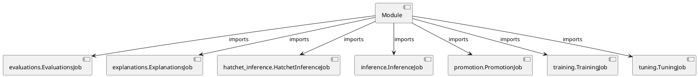

# Module Specification: __init__

* **Source Reference:** `src/autogen_team/application/jobs/__init__.py`

## 1. Architectural Role & Responsibilities
**Purpose:**
Provides functionality related to   init  .

**Architecture Layer:**
- Infrastructure/Other

**Responsibilities:**
- Not explicitly defined.

**Main Workflow:**
- Not explicitly defined.

## 2. Dependencies
**Imports:**
- `evaluations.EvaluationsJob`
- `explanations.ExplanationsJob`
- `hatchet_inference.HatchetInferenceJob`
- `inference.InferenceJob`
- `promotion.PromotionJob`
- `training.TrainingJob`
- `tuning.TuningJob`

**Exported Classes:**
- None

**Exported Functions:**
- None

## 3. Architecture & Execution
### Internal Architecture
Not explicitly defined.

### Execution Flow
Not explicitly defined.

### Sequence Explanation
Not explicitly defined.

## 4. UML 2.0 Diagrams
### Class Diagram

### Dependency Graph

## 5. Class & Method Specifications
## 6. Module Functions