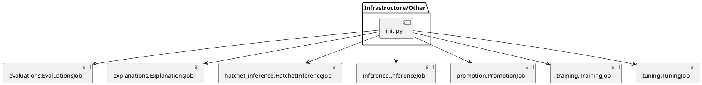
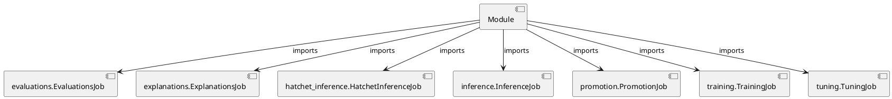

# Module Specification: __init__

* **Source Reference:** `src/autogen_team/application/jobs/__init__.py`

## 1. Architectural Role & Responsibilities
**Purpose:**
Provides functionality related to   init  .

**Architecture Layer:**
- Infrastructure/Other

**Responsibilities:**
- Manages operations and logic for   init  .

**Main Workflow:**
- Executes the primary flow defined by   init   functions and classes.

## 2. Dependencies
**Imports:**
- `evaluations.EvaluationsJob`
- `explanations.ExplanationsJob`
- `hatchet_inference.HatchetInferenceJob`
- `inference.InferenceJob`
- `promotion.PromotionJob`
- `training.TrainingJob`
- `tuning.TuningJob`

**Exported Classes:**
- None

**Exported Functions:**
- None

**Exported Interfaces:**
- Not explicitly defined.

**Public API:**
- Not explicitly defined.

## 3. Architecture & Execution
### Internal Architecture
Not explicitly defined.

### Execution Flow
Not explicitly defined.

### Sequence Explanation
Not explicitly defined.

### Examples
Not explicitly defined.

## 4. UML 2.0 Diagrams
### Class Diagram

```plantuml
@startuml
    ' No classes found in module
@enduml
```

### Sequence Diagram

```plantuml
@startuml
    ' No functions for sequence
@enduml
```

### Component Diagram

```plantuml
@startuml
    package "Infrastructure/Other" {
        [__init__.py]
    }
    [__init__.py] --> [evaluations.EvaluationsJob]
    [__init__.py] --> [explanations.ExplanationsJob]
    [__init__.py] --> [hatchet_inference.HatchetInferenceJob]
    [__init__.py] --> [inference.InferenceJob]
    [__init__.py] --> [promotion.PromotionJob]
    [__init__.py] --> [training.TrainingJob]
    [__init__.py] --> [tuning.TuningJob]
@enduml
```

### Dependency Graph

```plantuml
@startuml
    [Module] --> [evaluations.EvaluationsJob] : imports
    [Module] --> [explanations.ExplanationsJob] : imports
    [Module] --> [hatchet_inference.HatchetInferenceJob] : imports
    [Module] --> [inference.InferenceJob] : imports
    [Module] --> [promotion.PromotionJob] : imports
    [Module] --> [training.TrainingJob] : imports
    [Module] --> [tuning.TuningJob] : imports
@enduml
```

## 5. Class & Method Specifications
## 6. Module Functions
## 7. Call Graph
- No public API calls detected.

## 8. Cross References
- **Parent module:** ../__init__.md
- **Child modules:** hatchet_inference.md, tuning.md, evaluations.md, training.md, explanations.md, inference.md, base.md, promotion.md
- **Dependencies:** `hatchet_inference.HatchetInferenceJob`, `inference.InferenceJob`, `evaluations.EvaluationsJob`, `promotion.PromotionJob`, `explanations.ExplanationsJob`, `tuning.TuningJob`, `training.TrainingJob`
- **Used by:** None
- **Calls:** None
- **Called from:** None
- **Related classes:** [Classes](../../../../../classes/index.md)
- **Related interfaces:** Not explicitly defined.
- **Related diagrams:** [Diagrams](../../../../../diagrams/index.md)
