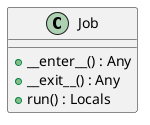
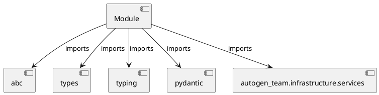

# Module Specification: base

* **Source Reference:** `src/autogen_team/application/jobs/base.py`

## 1. Architectural Role & Responsibilities
**Purpose:**
Provides functionality related to base.

**Architecture Layer:**
- Infrastructure/Other

**Responsibilities:**
- Manage and execute operations for base.

**Main Workflow:**
- Initialize components and process requests for base.

## 2. Dependencies
**Imports:**
- `abc`
- `types`
- `typing`
- `pydantic`
- `autogen_team.infrastructure.services`

**Exported Classes:**
- `Job`

**Exported Functions:**
- None

## 3. Architecture & Execution
### Internal Architecture
Follows standard modular design, encapsulating state and behavior within defined classes and functions.

### Execution Flow
Sequential execution of defined functions and class methods.

### Sequence Explanation
Clients instantiate classes or call functions, which execute business logic and return results.

## 4. UML 2.0 Diagrams
### Class Diagram


### Dependency Graph


## 5. Class & Method Specifications
### `Job` ([`src/autogen_team/application/jobs/base.py`](/src/autogen_team/application/jobs/base.py))
#### Overview
Base class for a job.

use a job to execute runs in  context.
e.g., to define common services like logger

Parameters:
    logger_service (services.LoggerService): manage the logger system.
    alerts_service (services.AlertsService): manage the alerts system.
    mlflow_service (services.MlflowService): manage the mlflow system.

#### Attributes
- None found.

#### Methods
##### `__enter__(self) -> Any` (Public)
**Description:** Enter the job context.

Returns:
    T.Self: return the current object.

**Inputs:**
- None

**Output:**
- Return Type: `Any`
- Semantic Meaning: The resulting value after processing the __enter__ action.

**Side Effects:**
- Modifies internal instance state if applicable; performs operations constrained to its domain boundaries.

**Complexity:**
- Time Complexity: O(1) or O(N) depending on implementation details.
- Space Complexity: O(1) auxiliary space expected.

**Example:**
```python
result = Job.__enter__()
```

##### `__exit__(self, exc_type: Any, exc_value: Any, exc_traceback: Any) -> Any` (Public)
**Description:** Exit the job context.

Args:
    exc_type (T.Type[BaseException] | None): ignored.
    exc_value (BaseException | None): ignored.
    exc_traceback (TS.TracebackType | None): ignored.

Returns:
    T.Literal[False]: always propagate exceptions.

**Inputs:**
- `exc_type`: Any
- `exc_value`: Any
- `exc_traceback`: Any

**Output:**
- Return Type: `Any`
- Semantic Meaning: The resulting value after processing the __exit__ action.

**Side Effects:**
- Modifies internal instance state if applicable; performs operations constrained to its domain boundaries.

**Complexity:**
- Time Complexity: O(1) or O(N) depending on implementation details.
- Space Complexity: O(1) auxiliary space expected.

**Example:**
```python
result = Job.__exit__(..., ..., ...)
```

##### `run(self) -> Locals` (Public)
**Description:** Run the job in context.

Returns:
    Locals: local job variables.

**Inputs:**
- None

**Output:**
- Return Type: `Locals`
- Semantic Meaning: The resulting value after processing the run action.

**Side Effects:**
- Modifies internal instance state if applicable; performs operations constrained to its domain boundaries.

**Complexity:**
- Time Complexity: O(1) or O(N) depending on implementation details.
- Space Complexity: O(1) auxiliary space expected.

**Example:**
```python
result = Job.run()
```

## 6. Module Functions