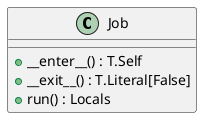
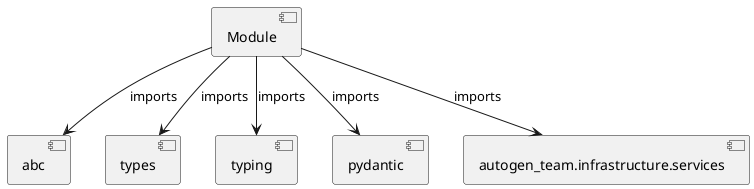

# Module Specification: base

* **Source Reference:** `src/autogen_team/application/jobs/base.py`

## 1. Architectural Role & Responsibilities
**Purpose:**
Provides functionality related to base.

**Architecture Layer:**
- Infrastructure/Other

**Responsibilities:**
- Not explicitly defined.

**Main Workflow:**
- Not explicitly defined.

## 2. Dependencies
**Imports:**
- `abc`
- `types`
- `typing`
- `pydantic`
- `autogen_team.infrastructure.services`

**Exported Classes:**
- `Job`

**Exported Functions:**
- None

## 3. Architecture & Execution
### Internal Architecture
Not explicitly defined.

### Execution Flow
Not explicitly defined.

### Sequence Explanation
Not explicitly defined.

## 4. UML 2.0 Diagrams
### Class Diagram


### Dependency Graph


## 5. Class & Method Specifications
### `Job` ([`src/autogen_team/application/jobs/base.py`](/src/autogen_team/application/jobs/base.py))
#### Overview
Base class for a job.

use a job to execute runs in  context.
e.g., to define common services like logger

Parameters:
    logger_service (services.LoggerService): manage the logger system.
    alerts_service (services.AlertsService): manage the alerts system.
    mlflow_service (services.MlflowService): manage the mlflow system.

#### Attributes
- None found.

#### Methods
##### `__enter__(self) -> T.Self` (Private)
**Purpose:** Enter the job context.

Returns:
    T.Self: return the current object.

**Parameters:**
- None

**Return value:**
- `T.Self`

##### `__exit__(self, exc_type: T.Type[BaseException] | None, exc_value: BaseException | None, exc_traceback: TS.TracebackType | None) -> T.Literal[False]` (Private)
**Purpose:** Exit the job context.

Args:
    exc_type (T.Type[BaseException] | None): ignored.
    exc_value (BaseException | None): ignored.
    exc_traceback (TS.TracebackType | None): ignored.

Returns:
    T.Literal[False]: always propagate exceptions.

**Parameters:**
- `exc_type`: T.Type[BaseException] | None
- `exc_value`: BaseException | None
- `exc_traceback`: TS.TracebackType | None

**Return value:**
- `T.Literal[False]`

##### `run(self) -> Locals` (Public)
**Description:** Run the job in context.

Returns:
    Locals: local job variables.

**Inputs:**
- None

**Output:**
- Return Type: `Locals`
- Semantic Meaning: Not explicitly defined.

**Side Effects:**
- Not explicitly defined.

**Complexity:**
- Time Complexity: Not explicitly defined.
- Space Complexity: Not explicitly defined.

**Example:**
```python
result = Job.run()
```

## 6. Module Functions