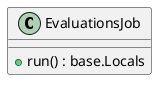
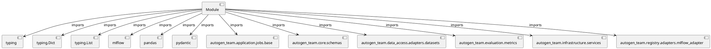

# Module Specification: evaluations

* **Source Reference:** `src/autogen_team/application/jobs/evaluations.py`

## 1. Architectural Role & Responsibilities
**Purpose:**
Provides functionality related to evaluations.

**Architecture Layer:**
- Infrastructure/Other

**Responsibilities:**
- Not explicitly defined.

**Main Workflow:**
- Not explicitly defined.

## 2. Dependencies
**Imports:**
- `typing`
- `typing.Dict`
- `typing.List`
- `mlflow`
- `pandas`
- `pydantic`
- `autogen_team.application.jobs.base`
- `autogen_team.core.schemas`
- `autogen_team.data_access.adapters.datasets`
- `autogen_team.evaluation.metrics`
- `autogen_team.infrastructure.services`
- `autogen_team.registry.adapters.mlflow_adapter`

**Exported Classes:**
- `EvaluationsJob`

**Exported Functions:**
- None

## 3. Architecture & Execution
### Internal Architecture
Not explicitly defined.

### Execution Flow
Not explicitly defined.

### Sequence Explanation
Not explicitly defined.

## 4. UML 2.0 Diagrams
### Class Diagram


### Dependency Graph


## 5. Class & Method Specifications
### `EvaluationsJob` ([`src/autogen_team/application/jobs/evaluations.py`](/src/autogen_team/application/jobs/evaluations.py))
#### Overview
Generate evaluations from a registered model and a dataset.

Parameters:
    run_config (services.MlflowService.RunConfig): mlflow run config.
    inputs (datasets.ReaderKind): reader for the inputs data.
    targets (datasets.ReaderKind): reader for the targets data.
    model_type (str): model type (e.g., "regressor", "classifier").
    alias_or_version (str | int): alias or version for the model.
    metrics (metrics_.MetricKind): metrics for the reporting.
    evaluators (list[str]): list of evaluators to use.
    thresholds (dict[str, metrics_.Threshold] | None): metric thresholds.

#### Attributes
- None found.

#### Methods
##### `run(self) -> base.Locals` (Public)
**Description:** No description provided.

**Inputs:**
- None

**Output:**
- Return Type: `base.Locals`
- Semantic Meaning: Not explicitly defined.

**Side Effects:**
- Not explicitly defined.

**Complexity:**
- Time Complexity: Not explicitly defined.
- Space Complexity: Not explicitly defined.

**Example:**
```python
result = EvaluationsJob.run()
```

## 6. Module Functions