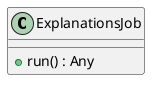
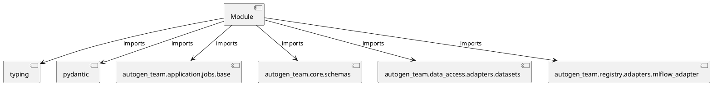

# Module Specification: explanations

* **Source Reference:** `src/autogen_team/application/jobs/explanations.py`

## 1. Architectural Role & Responsibilities
**Purpose:**
Provides functionality related to explanations.

**Architecture Layer:**
- Infrastructure/Other

**Responsibilities:**
- Manage and execute operations for explanations.

**Main Workflow:**
- Initialize components and process requests for explanations.

## 2. Dependencies
**Imports:**
- `typing`
- `pydantic`
- `autogen_team.application.jobs.base`
- `autogen_team.core.schemas`
- `autogen_team.data_access.adapters.datasets`
- `autogen_team.registry.adapters.mlflow_adapter`

**Exported Classes:**
- `ExplanationsJob`

**Exported Functions:**
- None

## 3. Architecture & Execution
### Internal Architecture
Follows standard modular design, encapsulating state and behavior within defined classes and functions.

### Execution Flow
Sequential execution of defined functions and class methods.

### Sequence Explanation
Clients instantiate classes or call functions, which execute business logic and return results.

## 4. UML 2.0 Diagrams
### Class Diagram


### Dependency Graph


## 5. Class & Method Specifications
### `ExplanationsJob` ([`src/autogen_team/application/jobs/explanations.py`](/src/autogen_team/application/jobs/explanations.py))
#### Overview
Generate explanations from the model and a data sample.

Parameters:
    inputs_samples (datasets.ReaderKind): reader for the samples data.
    models_explanations (datasets.WriterKind): writer for models explanation.
    samples_explanations (datasets.WriterKind): writer for samples explanation.
    alias_or_version (str | int): alias or version for the  model.
    loader (registries.LoaderKind): registry loader for the model.

#### Attributes
- None found.

#### Methods
##### `run(self) -> Any` (Public)
**Description:** Executes the run operation, mutating state or calculating derived values as necessary.

**Inputs:**
- None

**Output:**
- Return Type: `Any`
- Semantic Meaning: The resulting value after processing the run action.

**Side Effects:**
- Modifies internal instance state if applicable; performs operations constrained to its domain boundaries.

**Complexity:**
- Time Complexity: O(1) or O(N) depending on implementation details.
- Space Complexity: O(1) auxiliary space expected.

**Example:**
```python
result = ExplanationsJob.run()
```

## 6. Module Functions