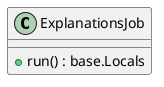
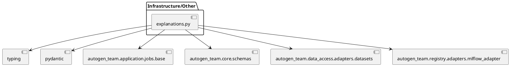
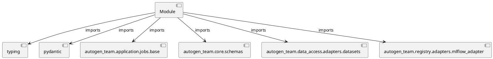
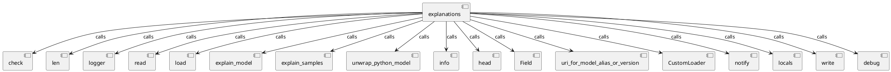

# Module Specification: explanations

* **Source Reference:** `src/autogen_team/application/jobs/explanations.py`

## 1. Architectural Role & Responsibilities
**Purpose:**
Provides functionality related to explanations.

**Architecture Layer:**
- Infrastructure/Other

**Responsibilities:**
- Manages operations and logic for explanations.

**Main Workflow:**
- Executes the primary flow defined by explanations functions and classes.

## 2. Dependencies
**Imports:**
- `typing`
- `pydantic`
- `autogen_team.application.jobs.base`
- `autogen_team.core.schemas`
- `autogen_team.data_access.adapters.datasets`
- `autogen_team.registry.adapters.mlflow_adapter`

**Exported Classes:**
- `ExplanationsJob`

**Exported Functions:**
- None

**Exported Interfaces:**
- Not explicitly defined.

**Public API:**
- Not explicitly defined.

## 3. Architecture & Execution
### Internal Architecture
Not explicitly defined.

### Execution Flow
Not explicitly defined.

### Sequence Explanation
Not explicitly defined.

### Examples
Not explicitly defined.

## 4. UML 2.0 Diagrams
### Class Diagram

```plantuml
@startuml
    class ExplanationsJob {
        +run() : base.Locals
    }
@enduml
```

### Sequence Diagram

```plantuml
@startuml
    ' No functions for sequence
@enduml
```

### Component Diagram

```plantuml
@startuml
    package "Infrastructure/Other" {
        [explanations.py]
    }
    [explanations.py] --> [typing]
    [explanations.py] --> [pydantic]
    [explanations.py] --> [autogen_team.application.jobs.base]
    [explanations.py] --> [autogen_team.core.schemas]
    [explanations.py] --> [autogen_team.data_access.adapters.datasets]
    [explanations.py] --> [autogen_team.registry.adapters.mlflow_adapter]
@enduml
```

### Dependency Graph

```plantuml
@startuml
    [Module] --> [typing] : imports
    [Module] --> [pydantic] : imports
    [Module] --> [autogen_team.application.jobs.base] : imports
    [Module] --> [autogen_team.core.schemas] : imports
    [Module] --> [autogen_team.data_access.adapters.datasets] : imports
    [Module] --> [autogen_team.registry.adapters.mlflow_adapter] : imports
@enduml
```

## 5. Class & Method Specifications
### `ExplanationsJob` ([`src/autogen_team/application/jobs/explanations.py`](/src/autogen_team/application/jobs/explanations.py))
#### Overview
Generate explanations from the model and a data sample.

Parameters:
    inputs_samples (datasets.ReaderKind): reader for the samples data.
    models_explanations (datasets.WriterKind): writer for models explanation.
    samples_explanations (datasets.WriterKind): writer for samples explanation.
    alias_or_version (str | int): alias or version for the  model.
    loader (registries.LoaderKind): registry loader for the model.

#### Attributes
- None found.

#### Methods
##### `run(self) -> base.Locals` (Public)
**Description:** Executes the run operation.

**Inputs:**
- None

**Output:**
- return type: `base.Locals`
- semantic meaning: Returns the result of run.
- possible null values: Yes, if base.Locals allows it.
- exceptions: Standard execution exceptions.

**Side Effects:**
- Database updates: Not explicitly defined.
- File operations: Not explicitly defined.
- Network calls: Not explicitly defined.
- Cache: Not explicitly defined.
- State changes: Not explicitly defined.

**Complexity:**
- Time Complexity: Not explicitly defined.
- Space Complexity: Not explicitly defined.

**Example:**
```python
result = ExplanationsJob.run()
```

## 6. Module Functions
## 7. Call Graph

```plantuml
@startuml
[explanations] --> [check] : calls
[explanations] --> [len] : calls
[explanations] --> [logger] : calls
[explanations] --> [read] : calls
[explanations] --> [load] : calls
[explanations] --> [explain_model] : calls
[explanations] --> [explain_samples] : calls
[explanations] --> [unwrap_python_model] : calls
[explanations] --> [info] : calls
[explanations] --> [head] : calls
[explanations] --> [Field] : calls
[explanations] --> [uri_for_model_alias_or_version] : calls
[explanations] --> [CustomLoader] : calls
[explanations] --> [notify] : calls
[explanations] --> [locals] : calls
[explanations] --> [write] : calls
[explanations] --> [debug] : calls
@enduml
```

## 8. Cross References
- **Parent module:** __init__.md
- **Child modules:** None
- **Dependencies:** `autogen_team.application.jobs.base`, `typing`, `autogen_team.core.schemas`, `autogen_team.data_access.adapters.datasets`, `pydantic`, `autogen_team.registry.adapters.mlflow_adapter`
- **Used by:** ../../../../tests/application/jobs/test_explanations.md
- **Calls:** check, len, logger, read, load, explain_model, explain_samples, unwrap_python_model, info, head, Field, uri_for_model_alias_or_version, CustomLoader, notify, locals, write, debug
- **Called from:** None
- **Related classes:** [Classes](../../../../../classes/index.md)
- **Related interfaces:** Not explicitly defined.
- **Related diagrams:** [Diagrams](../../../../../diagrams/index.md)
