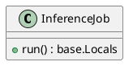
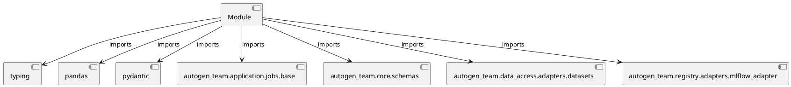

# Module Specification: inference

* **Source Reference:** `src/autogen_team/application/jobs/inference.py`

## 1. Architectural Role & Responsibilities
**Purpose:**
Provides functionality related to inference.

**Architecture Layer:**
- Infrastructure/Other

**Responsibilities:**
- Not explicitly defined.

**Main Workflow:**
- Not explicitly defined.

## 2. Dependencies
**Imports:**
- `typing`
- `pandas`
- `pydantic`
- `autogen_team.application.jobs.base`
- `autogen_team.core.schemas`
- `autogen_team.data_access.adapters.datasets`
- `autogen_team.registry.adapters.mlflow_adapter`

**Exported Classes:**
- `InferenceJob`

**Exported Functions:**
- None

## 3. Architecture & Execution
### Internal Architecture
Not explicitly defined.

### Execution Flow
Not explicitly defined.

### Sequence Explanation
Not explicitly defined.

## 4. UML 2.0 Diagrams
### Class Diagram


### Dependency Graph


## 5. Class & Method Specifications
### `InferenceJob` ([`src/autogen_team/application/jobs/inference.py`](/src/autogen_team/application/jobs/inference.py))
#### Overview
Generate batch predictions from a registered model.

Parameters:
    inputs (datasets.ReaderKind): reader for the inputs data.
    outputs (datasets.WriterKind): writer for the outputs data.
    alias_or_version (str | int): alias or version for the  model.
    loader (registries.LoaderKind): registry loader for the model.

#### Attributes
- None found.

#### Methods
##### `run(self) -> base.Locals` (Public)
**Description:** No description provided.

**Inputs:**
- None

**Output:**
- Return Type: `base.Locals`
- Semantic Meaning: Not explicitly defined.

**Side Effects:**
- Not explicitly defined.

**Complexity:**
- Time Complexity: Not explicitly defined.
- Space Complexity: Not explicitly defined.

**Example:**
```python
result = InferenceJob.run()
```

## 6. Module Functions