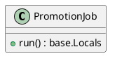
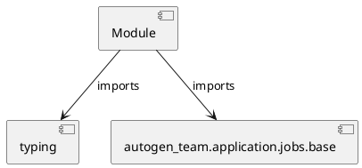

# Module Specification: promotion

* **Source Reference:** `src/autogen_team/application/jobs/promotion.py`

## 1. Architectural Role & Responsibilities
**Purpose:**
Provides functionality related to promotion.

**Architecture Layer:**
- Infrastructure/Other

**Responsibilities:**
- Not explicitly defined.

**Main Workflow:**
- Not explicitly defined.

## 2. Dependencies
**Imports:**
- `typing`
- `autogen_team.application.jobs.base`

**Exported Classes:**
- `PromotionJob`

**Exported Functions:**
- None

## 3. Architecture & Execution
### Internal Architecture
Not explicitly defined.

### Execution Flow
Not explicitly defined.

### Sequence Explanation
Not explicitly defined.

## 4. UML 2.0 Diagrams
### Class Diagram


### Dependency Graph


## 5. Class & Method Specifications
### `PromotionJob` ([`src/autogen_team/application/jobs/promotion.py`](/src/autogen_team/application/jobs/promotion.py))
#### Overview
Define a job for promoting a registered model version with an alias.

https://mlflow.org/docs/latest/model-registry.html#concepts

Parameters:
    alias (str): the mlflow alias to transition the registered model version.
    version (int | None): the model version to transition (use None for latest).

#### Attributes
- None found.

#### Methods
##### `run(self) -> base.Locals` (Public)
**Description:** No description provided.

**Inputs:**
- None

**Output:**
- Return Type: `base.Locals`
- Semantic Meaning: Not explicitly defined.

**Side Effects:**
- Not explicitly defined.

**Complexity:**
- Time Complexity: Not explicitly defined.
- Space Complexity: Not explicitly defined.

**Example:**
```python
result = PromotionJob.run()
```

## 6. Module Functions