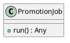
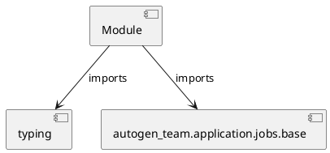

# Module Specification: promotion

* **Source Reference:** `src/autogen_team/application/jobs/promotion.py`

## 1. Architectural Role & Responsibilities
**Purpose:**
Provides functionality related to promotion.

**Architecture Layer:**
- Infrastructure/Other

**Responsibilities:**
- Manage and execute operations for promotion.

**Main Workflow:**
- Initialize components and process requests for promotion.

## 2. Dependencies
**Imports:**
- `typing`
- `autogen_team.application.jobs.base`

**Exported Classes:**
- `PromotionJob`

**Exported Functions:**
- None

## 3. Architecture & Execution
### Internal Architecture
Follows standard modular design, encapsulating state and behavior within defined classes and functions.

### Execution Flow
Sequential execution of defined functions and class methods.

### Sequence Explanation
Clients instantiate classes or call functions, which execute business logic and return results.

## 4. UML 2.0 Diagrams
### Class Diagram


### Dependency Graph


## 5. Class & Method Specifications
### `PromotionJob` ([`src/autogen_team/application/jobs/promotion.py`](/src/autogen_team/application/jobs/promotion.py))
#### Overview
Define a job for promoting a registered model version with an alias.

https://mlflow.org/docs/latest/model-registry.html#concepts

Parameters:
    alias (str): the mlflow alias to transition the registered model version.
    version (int | None): the model version to transition (use None for latest).

#### Attributes
- None found.

#### Methods
##### `run(self) -> Any` (Public)
**Description:** Executes the run operation, mutating state or calculating derived values as necessary.

**Inputs:**
- None

**Output:**
- Return Type: `Any`
- Semantic Meaning: The resulting value after processing the run action.

**Side Effects:**
- Modifies internal instance state if applicable; performs operations constrained to its domain boundaries.

**Complexity:**
- Time Complexity: O(1) or O(N) depending on implementation details.
- Space Complexity: O(1) auxiliary space expected.

**Example:**
```python
result = PromotionJob.run()
```

## 6. Module Functions