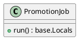
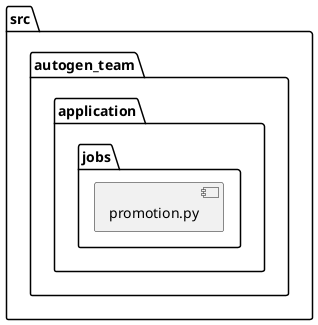
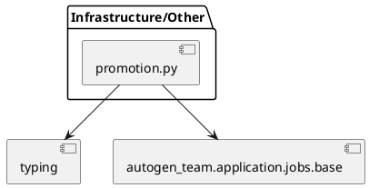
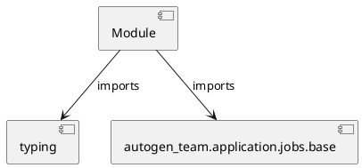
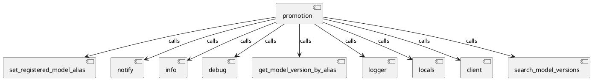

# Module Specification: promotion

* **Source Reference:** `src/autogen_team/application/jobs/promotion.py`

## 1. Architectural Role & Responsibilities
**Purpose:**
Provides functionality related to promotion.

**Architecture Layer:**
- Infrastructure/Other

**Responsibilities:**
- Not explicitly defined.

**Main Workflow:**
- Not explicitly defined.

## 2. Dependencies
**Imports:**
- `typing`
- `autogen_team.application.jobs.base`

**Exported Classes:**
- `PromotionJob`

**Exported Functions:**
- None

**Exported Interfaces:**
- Not explicitly defined.

**Public API:**
- Not explicitly defined.

## 3. Architecture & Execution
### Internal Architecture
Not explicitly defined.

### Execution Flow
Not explicitly defined.

### Sequence Explanation
Not explicitly defined.

### Examples
Not explicitly defined.

## 4. UML 2.0 Diagrams
### Class Diagram

```plantuml
@startuml
    class PromotionJob {
        +run() : base.Locals
    }
@enduml
```

### Package Diagram

```plantuml
@startuml
    package "src" {
        package "autogen_team" {
            package "application" {
                package "jobs" {
                    [promotion.py]
                }
            }
        }
    }
@enduml
```

### Sequence Diagram

```plantuml
@startuml
    ' No functions for sequence
@enduml
```

### Component Diagram

```plantuml
@startuml
    package "Infrastructure/Other" {
        [promotion.py]
    }
    [promotion.py] --> [typing]
    [promotion.py] --> [autogen_team.application.jobs.base]
@enduml
```

### Dependency Graph

```plantuml
@startuml
    [Module] --> [typing] : imports
    [Module] --> [autogen_team.application.jobs.base] : imports
@enduml
```

## 5. Class & Method Specifications
### `PromotionJob` ([`src/autogen_team/application/jobs/promotion.py`](/src/autogen_team/application/jobs/promotion.py))
#### Overview
Define a job for promoting a registered model version with an alias.

https://mlflow.org/docs/latest/model-registry.html#concepts

Parameters:
    alias (str): the mlflow alias to transition the registered model version.
    version (int | None): the model version to transition (use None for latest).

#### Attributes
- None found.

#### Methods
##### `run(self) -> base.Locals` (Public)
**Description:** Executes the run operation.

**Inputs:**
- None

**Output:**
- return type: `base.Locals`
- semantic meaning: Not explicitly defined.
- possible null values: Not explicitly defined.
- exceptions: Not explicitly defined.

**Side Effects:**
- Database updates: Not explicitly defined.
- File operations: Not explicitly defined.
- Network calls: Not explicitly defined.
- Cache: Not explicitly defined.
- State changes: Not explicitly defined.

**Complexity:**
- Time Complexity: Not explicitly defined.
- Space Complexity: Not explicitly defined.

**Example:**
```python
result = PromotionJob.run()
```

## 6. Module Functions
## 7. Call Graph

```plantuml
@startuml
[promotion] --> [set_registered_model_alias] : calls
[promotion] --> [notify] : calls
[promotion] --> [info] : calls
[promotion] --> [debug] : calls
[promotion] --> [get_model_version_by_alias] : calls
[promotion] --> [logger] : calls
[promotion] --> [locals] : calls
[promotion] --> [client] : calls
[promotion] --> [search_model_versions] : calls
@enduml
```

## 8. Cross References
- **Dependencies:** [Dependencies](../../../../../dependencies/index.md)
- **Used by:** ../../../../tests/application/jobs/test_promotion.md
- **Calls:** set_registered_model_alias, notify, info, debug, get_model_version_by_alias, logger, locals, client, search_model_versions
- **Called from:** None
- **Related classes:** [Classes](../../../../../classes/index.md)
- **Related diagrams:** [Diagrams](../../../../../diagrams/index.md)
