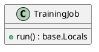

# Module Specification: training

* **Source Reference:** `src/autogen_team/application/jobs/training.py`

## 1. Architectural Role & Responsibilities
**Purpose:**
Provides functionality related to training.

**Architecture Layer:**
- Infrastructure/Other

**Responsibilities:**
- Not explicitly defined.

**Main Workflow:**
- Not explicitly defined.

## 2. Dependencies
**Imports:**
- `typing`
- `mlflow`
- `pydantic`
- `autogen_team.application.jobs.base`
- `autogen_team.core.schemas`
- `autogen_team.data_access.adapters.datasets`
- `autogen_team.evaluation.metrics.metrics`
- `autogen_team.infrastructure.services`
- `autogen_team.infrastructure.utils.signers`
- `autogen_team.infrastructure.utils.splitters`
- `autogen_team.models.entities`
- `autogen_team.registry.adapters.mlflow_adapter`

**Exported Classes:**
- `TrainingJob`

**Exported Functions:**
- None

## 3. Architecture & Execution
### Internal Architecture
Not explicitly defined.

### Execution Flow
Not explicitly defined.

### Sequence Explanation
Not explicitly defined.

## 4. UML 2.0 Diagrams
### Class Diagram


### Dependency Graph

```plantuml
@startuml
    [Module] --> [typing] : imports
    [Module] --> [mlflow] : imports
    [Module] --> [pydantic] : imports
    [Module] --> [autogen_team.application.jobs.base] : imports
    [Module] --> [autogen_team.core.schemas] : imports
    [Module] --> [autogen_team.data_access.adapters.datasets] : imports
    [Module] --> [autogen_team.evaluation.metrics.metrics] : imports
    [Module] --> [autogen_team.infrastructure.services] : imports
    [Module] --> [autogen_team.infrastructure.utils.signers] : imports
    [Module] --> [autogen_team.infrastructure.utils.splitters] : imports
    [Module] --> [autogen_team.models.entities] : imports
    [Module] --> [autogen_team.registry.adapters.mlflow_adapter] : imports
@enduml
```


## 5. Class & Method Specifications
### `TrainingJob` ([`src/autogen_team/application/jobs/training.py`](/src/autogen_team/application/jobs/training.py))
#### Overview
Train and register a single AI/ML model.

Parameters:
    run_config (services.MlflowService.RunConfig): mlflow run config.
    inputs (datasets.ReaderKind): reader for the inputs data.
    targets (datasets.ReaderKind): reader for the targets data.
    model (models.ModelKind): machine learning model to train.
    metrics (metrics_.MetricKind): metrics for the reporting.
    splitter (splitters.SplitterKind): data sets splitter.
    saver (registries.SaverKind): model saver.
    signer (signers.SignerKind): model signer.
    registry (registries.RegisterKind): model register.

#### Attributes
- None found.

#### Methods
##### `run(self) -> base.Locals` (Public)
**Description:** No description provided.

**Inputs:**
- None

**Output:**
- Return Type: `base.Locals`
- Semantic Meaning: Not explicitly defined.

**Side Effects:**
- Not explicitly defined.

**Complexity:**
- Time Complexity: Not explicitly defined.
- Space Complexity: Not explicitly defined.

**Example:**
```python
result = TrainingJob.run()
```

## 6. Module Functions