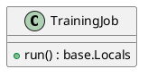
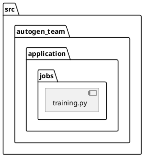

# Module Specification: training

* **Source Reference:** `src/autogen_team/application/jobs/training.py`

## 1. Architectural Role & Responsibilities
**Purpose:**
Provides functionality related to training.

**Architecture Layer:**
- Infrastructure/Other

**Responsibilities:**
- Not explicitly defined.

**Main Workflow:**
- Not explicitly defined.

## 2. Dependencies
**Imports:**
- `typing`
- `mlflow`
- `pydantic`
- `autogen_team.application.jobs.base`
- `autogen_team.core.schemas`
- `autogen_team.data_access.adapters.datasets`
- `autogen_team.evaluation.metrics.metrics`
- `autogen_team.infrastructure.services`
- `autogen_team.infrastructure.utils.signers`
- `autogen_team.infrastructure.utils.splitters`
- `autogen_team.models.entities`
- `autogen_team.registry.adapters.mlflow_adapter`

**Exported Classes:**
- `TrainingJob`

**Exported Functions:**
- None

**Exported Interfaces:**
- Not explicitly defined.

**Public API:**
- Not explicitly defined.

## 3. Architecture & Execution
### Internal Architecture
Not explicitly defined.

### Execution Flow
Not explicitly defined.

### Sequence Explanation
Not explicitly defined.

### Examples
Not explicitly defined.

## 4. UML 2.0 Diagrams
### Class Diagram

```plantuml
@startuml
    class TrainingJob {
        +run() : base.Locals
    }
@enduml
```

### Package Diagram

```plantuml
@startuml
    package "src" {
        package "autogen_team" {
            package "application" {
                package "jobs" {
                    [training.py]
                }
            }
        }
    }
@enduml
```

### Sequence Diagram

```plantuml
@startuml
    ' No functions for sequence
@enduml
```

### Component Diagram

```plantuml
@startuml
    package "Infrastructure/Other" {
        [training.py]
    }
    [training.py] --> [typing]
    [training.py] --> [mlflow]
    [training.py] --> [pydantic]
    [training.py] --> [autogen_team.application.jobs.base]
    [training.py] --> [autogen_team.core.schemas]
    [training.py] --> [autogen_team.data_access.adapters.datasets]
    [training.py] --> [autogen_team.evaluation.metrics.metrics]
    [training.py] --> [autogen_team.infrastructure.services]
    [training.py] --> [autogen_team.infrastructure.utils.signers]
    [training.py] --> [autogen_team.infrastructure.utils.splitters]
    [training.py] --> [autogen_team.models.entities]
    [training.py] --> [autogen_team.registry.adapters.mlflow_adapter]
@enduml
```

### Dependency Graph

```plantuml
@startuml
    [Module] --> [typing] : imports
    [Module] --> [mlflow] : imports
    [Module] --> [pydantic] : imports
    [Module] --> [autogen_team.application.jobs.base] : imports
    [Module] --> [autogen_team.core.schemas] : imports
    [Module] --> [autogen_team.data_access.adapters.datasets] : imports
    [Module] --> [autogen_team.evaluation.metrics.metrics] : imports
    [Module] --> [autogen_team.infrastructure.services] : imports
    [Module] --> [autogen_team.infrastructure.utils.signers] : imports
    [Module] --> [autogen_team.infrastructure.utils.splitters] : imports
    [Module] --> [autogen_team.models.entities] : imports
    [Module] --> [autogen_team.registry.adapters.mlflow_adapter] : imports
@enduml
```

## 5. Class & Method Specifications
### `TrainingJob` ([`src/autogen_team/application/jobs/training.py`](/src/autogen_team/application/jobs/training.py))
#### Overview
Train and register a single AI/ML model.

Parameters:
    run_config (services.MlflowService.RunConfig): mlflow run config.
    inputs (datasets.ReaderKind): reader for the inputs data.
    targets (datasets.ReaderKind): reader for the targets data.
    model (models.ModelKind): machine learning model to train.
    metrics (metrics_.MetricKind): metrics for the reporting.
    splitter (splitters.SplitterKind): data sets splitter.
    saver (registries.SaverKind): model saver.
    signer (signers.SignerKind): model signer.
    registry (registries.RegisterKind): model register.

#### Attributes
- None found.

#### Methods
##### `run(self) -> base.Locals` (Public)
**Description:** No description provided.

**Inputs:**
- None

**Output:**
- return type: `base.Locals`
- semantic meaning: Not explicitly defined.
- possible null values: Not explicitly defined.
- exceptions: Not explicitly defined.

**Side Effects:**
- Database updates: Not explicitly defined.
- File operations: Not explicitly defined.
- Network calls: Not explicitly defined.
- Cache: Not explicitly defined.
- State changes: Not explicitly defined.

**Complexity:**
- Time Complexity: Not explicitly defined.
- Space Complexity: Not explicitly defined.

**Example:**
```python
result = TrainingJob.run()
```

## 6. Module Functions
## 7. Call Graph

```plantuml
@startuml
[training] --> [split] : calls
[training] --> [cast] : calls
[training] --> [client] : calls
[training] --> [save] : calls
[training] --> [info] : calls
[training] --> [RunConfig] : calls
[training] --> [notify] : calls
[training] --> [debug] : calls
[training] --> [AutogenMetric] : calls
[training] --> [register] : calls
[training] --> [TrainTestSplitter] : calls
[training] --> [len] : calls
[training] --> [read] : calls
[training] --> [check] : calls
[training] --> [load_context_path] : calls
[training] --> [BaselineAutogenModel] : calls
[training] --> [enumerate] : calls
[training] --> [to_dict] : calls
[training] --> [run_context] : calls
[training] --> [InferSigner] : calls
[training] --> [log_metric] : calls
[training] --> [lineage] : calls
[training] --> [log_input] : calls
[training] --> [sign] : calls
[training] --> [logger] : calls
[training] --> [MlflowRegister] : calls
[training] --> [score] : calls
[training] --> [locals] : calls
[training] --> [next] : calls
[training] --> [predict] : calls
[training] --> [fit] : calls
[training] --> [Field] : calls
[training] --> [CustomSaver] : calls
@enduml
```

## 8. Cross References
- **Dependencies:** [Dependencies](../../../../../dependencies/index.md)
- **Used by:** ../../../../tests/application/jobs/test_training.md
- **Calls:** split, cast, client, save, info, RunConfig, notify, debug, AutogenMetric, register, TrainTestSplitter, len, read, check, load_context_path, BaselineAutogenModel, enumerate, to_dict, run_context, InferSigner, log_metric, lineage, log_input, sign, logger, MlflowRegister, score, locals, next, predict, fit, Field, CustomSaver
- **Called from:** None
- **Related classes:** [Classes](../../../../../classes/index.md)
- **Related diagrams:** [Diagrams](../../../../../diagrams/index.md)
