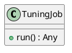

# Module Specification: tuning

* **Source Reference:** `src/autogen_team/application/jobs/tuning.py`

## 1. Architectural Role & Responsibilities
**Purpose:**
Provides functionality related to tuning.

**Architecture Layer:**
- Infrastructure/Other

**Responsibilities:**
- Manage and execute operations for tuning.

**Main Workflow:**
- Initialize components and process requests for tuning.

## 2. Dependencies
**Imports:**
- `typing`
- `mlflow`
- `pydantic`
- `autogen_team.application.jobs.base`
- `autogen_team.core.schemas`
- `autogen_team.data_access.adapters.datasets`
- `autogen_team.evaluation.metrics`
- `autogen_team.infrastructure.services`
- `autogen_team.infrastructure.utils.searchers`
- `autogen_team.infrastructure.utils.splitters`
- `autogen_team.models.entities`

**Exported Classes:**
- `TuningJob`

**Exported Functions:**
- None

## 3. Architecture & Execution
### Internal Architecture
Follows standard modular design, encapsulating state and behavior within defined classes and functions.

### Execution Flow
Sequential execution of defined functions and class methods.

### Sequence Explanation
Clients instantiate classes or call functions, which execute business logic and return results.

## 4. UML 2.0 Diagrams
### Class Diagram


### Dependency Graph

```plantuml
@startuml
    [Module] --> [typing] : imports
    [Module] --> [mlflow] : imports
    [Module] --> [pydantic] : imports
    [Module] --> [autogen_team.application.jobs.base] : imports
    [Module] --> [autogen_team.core.schemas] : imports
    [Module] --> [autogen_team.data_access.adapters.datasets] : imports
    [Module] --> [autogen_team.evaluation.metrics] : imports
    [Module] --> [autogen_team.infrastructure.services] : imports
    [Module] --> [autogen_team.infrastructure.utils.searchers] : imports
    [Module] --> [autogen_team.infrastructure.utils.splitters] : imports
    [Module] --> [autogen_team.models.entities] : imports
@enduml
```


## 5. Class & Method Specifications
### `TuningJob` ([`src/autogen_team/application/jobs/tuning.py`](/src/autogen_team/application/jobs/tuning.py))
#### Overview
Find the best hyperparameters for a model.
https://microsoft.github.io/FLAML/docs/Examples/AutoGen-OpenAI/
https://github.com/microsoft/FLAML/blob/main/notebook/autogen_openai_completion.ipynb

Parameters:
    run_config (services.MlflowService.RunConfig): mlflow run config.
    inputs (datasets.ReaderKind): reader for the inputs data.
    targets (datasets.ReaderKind): reader for the targets data.
    model (models.ModelKind): machine learning model to tune.
    metric (metrics.MetricKind): tuning metric to optimize.
    splitter (splitters.SplitterKind): data sets splitter.
    searcher: (searchers.SearcherKind): hparams searcher.

#### Attributes
- None found.

#### Methods
##### `run(self) -> Any` (Public)
**Description:** Run the tuning job in context.

**Inputs:**
- None

**Output:**
- Return Type: `Any`
- Semantic Meaning: The resulting value after processing the run action.

**Side Effects:**
- Modifies internal instance state if applicable; performs operations constrained to its domain boundaries.

**Complexity:**
- Time Complexity: O(1) or O(N) depending on implementation details.
- Space Complexity: O(1) auxiliary space expected.

**Example:**
```python
result = TuningJob.run()
```

## 6. Module Functions