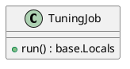
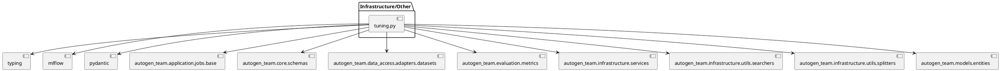
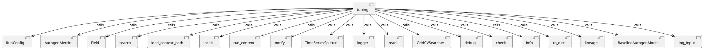

# Module Specification: tuning

* **Source Reference:** `src/autogen_team/application/jobs/tuning.py`

## 1. Architectural Role & Responsibilities
**Purpose:**
Provides functionality related to tuning.

**Architecture Layer:**
- Infrastructure/Other

**Responsibilities:**
- Manages operations and logic for tuning.

**Main Workflow:**
- Executes the primary flow defined by tuning functions and classes.

## 2. Dependencies
**Imports:**
- `typing`
- `mlflow`
- `pydantic`
- `autogen_team.application.jobs.base`
- `autogen_team.core.schemas`
- `autogen_team.data_access.adapters.datasets`
- `autogen_team.evaluation.metrics`
- `autogen_team.infrastructure.services`
- `autogen_team.infrastructure.utils.searchers`
- `autogen_team.infrastructure.utils.splitters`
- `autogen_team.models.entities`

**Exported Classes:**
- `TuningJob`

**Exported Functions:**
- None

**Exported Interfaces:**
- Not explicitly defined.

**Public API:**
- Not explicitly defined.

## 3. Architecture & Execution
### Internal Architecture
Not explicitly defined.

### Execution Flow
Not explicitly defined.

### Sequence Explanation
Not explicitly defined.

### Examples
Not explicitly defined.

## 4. UML 2.0 Diagrams
### Class Diagram

```plantuml
@startuml
    class TuningJob {
        +run() : base.Locals
    }
@enduml
```

### Sequence Diagram

```plantuml
@startuml
    ' No functions for sequence
@enduml
```

### Component Diagram

```plantuml
@startuml
    package "Infrastructure/Other" {
        [tuning.py]
    }
    [tuning.py] --> [typing]
    [tuning.py] --> [mlflow]
    [tuning.py] --> [pydantic]
    [tuning.py] --> [autogen_team.application.jobs.base]
    [tuning.py] --> [autogen_team.core.schemas]
    [tuning.py] --> [autogen_team.data_access.adapters.datasets]
    [tuning.py] --> [autogen_team.evaluation.metrics]
    [tuning.py] --> [autogen_team.infrastructure.services]
    [tuning.py] --> [autogen_team.infrastructure.utils.searchers]
    [tuning.py] --> [autogen_team.infrastructure.utils.splitters]
    [tuning.py] --> [autogen_team.models.entities]
@enduml
```

### Dependency Graph

```plantuml
@startuml
    [Module] --> [typing] : imports
    [Module] --> [mlflow] : imports
    [Module] --> [pydantic] : imports
    [Module] --> [autogen_team.application.jobs.base] : imports
    [Module] --> [autogen_team.core.schemas] : imports
    [Module] --> [autogen_team.data_access.adapters.datasets] : imports
    [Module] --> [autogen_team.evaluation.metrics] : imports
    [Module] --> [autogen_team.infrastructure.services] : imports
    [Module] --> [autogen_team.infrastructure.utils.searchers] : imports
    [Module] --> [autogen_team.infrastructure.utils.splitters] : imports
    [Module] --> [autogen_team.models.entities] : imports
@enduml
```

## 5. Class & Method Specifications
### `TuningJob` ([`src/autogen_team/application/jobs/tuning.py`](/src/autogen_team/application/jobs/tuning.py))
#### Overview
Find the best hyperparameters for a model.
https://microsoft.github.io/FLAML/docs/Examples/AutoGen-OpenAI/
https://github.com/microsoft/FLAML/blob/main/notebook/autogen_openai_completion.ipynb

Parameters:
    run_config (services.MlflowService.RunConfig): mlflow run config.
    inputs (datasets.ReaderKind): reader for the inputs data.
    targets (datasets.ReaderKind): reader for the targets data.
    model (models.ModelKind): machine learning model to tune.
    metric (metrics.MetricKind): tuning metric to optimize.
    splitter (splitters.SplitterKind): data sets splitter.
    searcher: (searchers.SearcherKind): hparams searcher.

#### Attributes
- None found.

#### Methods
##### `run(self) -> base.Locals` (Public)
**Description:** Run the tuning job in context.

**Inputs:**
- None

**Output:**
- return type: `base.Locals`
- semantic meaning: Returns the result of run.
- possible null values: Yes, if base.Locals allows it.
- exceptions: Standard execution exceptions.

**Side Effects:**
- Database updates: Not explicitly defined.
- File operations: Not explicitly defined.
- Network calls: Not explicitly defined.
- Cache: Not explicitly defined.
- State changes: Not explicitly defined.

**Complexity:**
- Time Complexity: Not explicitly defined.
- Space Complexity: Not explicitly defined.

**Example:**
```python
result = TuningJob.run()
```

## 6. Module Functions
## 7. Call Graph

```plantuml
@startuml
[tuning] --> [RunConfig] : calls
[tuning] --> [AutogenMetric] : calls
[tuning] --> [Field] : calls
[tuning] --> [search] : calls
[tuning] --> [load_context_path] : calls
[tuning] --> [locals] : calls
[tuning] --> [run_context] : calls
[tuning] --> [notify] : calls
[tuning] --> [TimeSeriesSplitter] : calls
[tuning] --> [logger] : calls
[tuning] --> [read] : calls
[tuning] --> [GridCVSearcher] : calls
[tuning] --> [debug] : calls
[tuning] --> [check] : calls
[tuning] --> [info] : calls
[tuning] --> [to_dict] : calls
[tuning] --> [lineage] : calls
[tuning] --> [BaselineAutogenModel] : calls
[tuning] --> [log_input] : calls
@enduml
```

## 8. Cross References
- **Parent module:** __init__.md
- **Child modules:** None
- **Dependencies:** `autogen_team.application.jobs.base`, `typing`, `autogen_team.models.entities`, `mlflow`, `autogen_team.core.schemas`, `autogen_team.data_access.adapters.datasets`, `autogen_team.infrastructure.services`, `autogen_team.evaluation.metrics`, `autogen_team.infrastructure.utils.searchers`, `pydantic`, `autogen_team.infrastructure.utils.splitters`
- **Used by:** ../../../../tests/application/jobs/test_tuning.md
- **Calls:** RunConfig, AutogenMetric, Field, search, load_context_path, locals, run_context, notify, TimeSeriesSplitter, logger, read, GridCVSearcher, debug, check, info, to_dict, lineage, BaselineAutogenModel, log_input
- **Called from:** None
- **Related classes:** [Classes](../../../../../classes/index.md)
- **Related interfaces:** Not explicitly defined.
- **Related diagrams:** [Diagrams](../../../../../diagrams/index.md)
