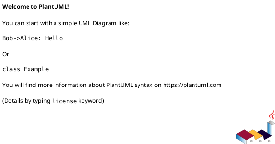
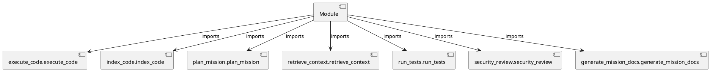

# Module Specification: __init__

* **Source Reference:** `src/autogen_team/application/mcp/tools/__init__.py`

## 1. Architectural Role & Responsibilities
**Purpose:**
Provides functionality related to   init  .

**Architecture Layer:**
- Infrastructure/Other

**Responsibilities:**
- Manage and execute operations for __init__.

**Main Workflow:**
- Initialize components and process requests for __init__.

## 2. Dependencies
**Imports:**
- `execute_code.execute_code`
- `index_code.index_code`
- `plan_mission.plan_mission`
- `retrieve_context.retrieve_context`
- `run_tests.run_tests`
- `security_review.security_review`
- `generate_mission_docs.generate_mission_docs`

**Exported Classes:**
- None

**Exported Functions:**
- None

## 3. Architecture & Execution
### Internal Architecture
Follows standard modular design, encapsulating state and behavior within defined classes and functions.

### Execution Flow
Sequential execution of defined functions and class methods.

### Sequence Explanation
Clients instantiate classes or call functions, which execute business logic and return results.

## 4. UML 2.0 Diagrams
### Class Diagram

### Dependency Graph

## 5. Class & Method Specifications
## 6. Module Functions