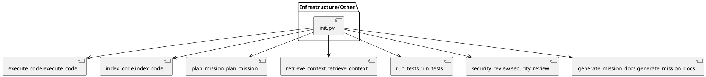
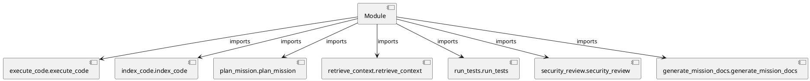

# Module Specification: __init__

* **Source Reference:** `src/autogen_team/application/mcp/tools/__init__.py`

## 1. Architectural Role & Responsibilities
**Purpose:**
Provides functionality related to   init  .

**Architecture Layer:**
- Infrastructure/Other

**Responsibilities:**
- Manages operations and logic for   init  .

**Main Workflow:**
- Executes the primary flow defined by   init   functions and classes.

## 2. Dependencies
**Imports:**
- `execute_code.execute_code`
- `index_code.index_code`
- `plan_mission.plan_mission`
- `retrieve_context.retrieve_context`
- `run_tests.run_tests`
- `security_review.security_review`
- `generate_mission_docs.generate_mission_docs`

**Exported Classes:**
- None

**Exported Functions:**
- None

**Exported Interfaces:**
- Not explicitly defined.

**Public API:**
- Not explicitly defined.

## 3. Architecture & Execution
### Internal Architecture
Not explicitly defined.

### Execution Flow
Not explicitly defined.

### Sequence Explanation
Not explicitly defined.

### Examples
Not explicitly defined.

## 4. UML 2.0 Diagrams
### Class Diagram

```plantuml
@startuml
    ' No classes found in module
@enduml
```

### Sequence Diagram

```plantuml
@startuml
    ' No functions for sequence
@enduml
```

### Component Diagram

```plantuml
@startuml
    package "Infrastructure/Other" {
        [__init__.py]
    }
    [__init__.py] --> [execute_code.execute_code]
    [__init__.py] --> [index_code.index_code]
    [__init__.py] --> [plan_mission.plan_mission]
    [__init__.py] --> [retrieve_context.retrieve_context]
    [__init__.py] --> [run_tests.run_tests]
    [__init__.py] --> [security_review.security_review]
    [__init__.py] --> [generate_mission_docs.generate_mission_docs]
@enduml
```

### Dependency Graph

```plantuml
@startuml
    [Module] --> [execute_code.execute_code] : imports
    [Module] --> [index_code.index_code] : imports
    [Module] --> [plan_mission.plan_mission] : imports
    [Module] --> [retrieve_context.retrieve_context] : imports
    [Module] --> [run_tests.run_tests] : imports
    [Module] --> [security_review.security_review] : imports
    [Module] --> [generate_mission_docs.generate_mission_docs] : imports
@enduml
```

## 5. Class & Method Specifications
## 6. Module Functions
## 7. Call Graph
- No public API calls detected.

## 8. Cross References
- **Parent module:** ../__init__.md
- **Child modules:** index_code.md, plan_mission.md, security_review.md, run_tests.md, execute_code.md, generate_mission_docs.md, retrieve_context.md
- **Dependencies:** `index_code.index_code`, `security_review.security_review`, `retrieve_context.retrieve_context`, `plan_mission.plan_mission`, `execute_code.execute_code`, `run_tests.run_tests`, `generate_mission_docs.generate_mission_docs`
- **Used by:** None
- **Calls:** None
- **Called from:** None
- **Related classes:** [Classes](../../../../../../classes/index.md)
- **Related interfaces:** Not explicitly defined.
- **Related diagrams:** [Diagrams](../../../../../../diagrams/index.md)
