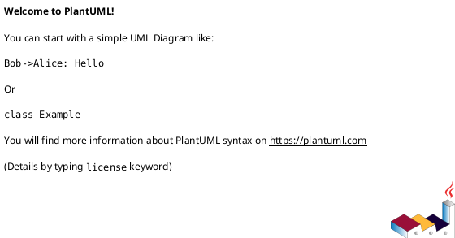
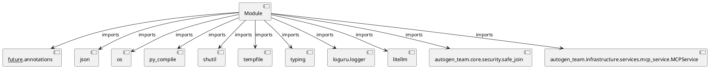

# Module Specification: execute_code

* **Source Reference:** `src/autogen_team/application/mcp/tools/execute_code.py`

## 1. Architectural Role & Responsibilities
**Purpose:**
Provides functionality related to execute code.

**Architecture Layer:**
- Infrastructure/Other

**Responsibilities:**
- Manage and execute operations for execute_code.

**Main Workflow:**
- Initialize components and process requests for execute_code.

## 2. Dependencies
**Imports:**
- `__future__.annotations`
- `json`
- `os`
- `py_compile`
- `shutil`
- `tempfile`
- `typing`
- `loguru.logger`
- `litellm`
- `autogen_team.core.security.safe_join`
- `autogen_team.infrastructure.services.mcp_service.MCPService`

**Exported Classes:**
- None

**Exported Functions:**
- `execute_code`

## 3. Architecture & Execution
### Internal Architecture
Follows standard modular design, encapsulating state and behavior within defined classes and functions.

### Execution Flow
Sequential execution of defined functions and class methods.

### Sequence Explanation
Clients instantiate classes or call functions, which execute business logic and return results.

## 4. UML 2.0 Diagrams
### Class Diagram

### Dependency Graph

## 5. Class & Method Specifications
## 6. Module Functions
### `execute_code(task: Any, workspace_path: str)`
Generate code changes for a task and validate in sandbox.

Args:
    task: A task dict (from DAG) with id, name, description.
    workspace_path: Path to the workspace root.

Returns:
    A dict with files_changed list and status.

**Inputs:**
- `task`: Any
- `workspace_path`: str

**Output:**
- Return Type: `Any`
