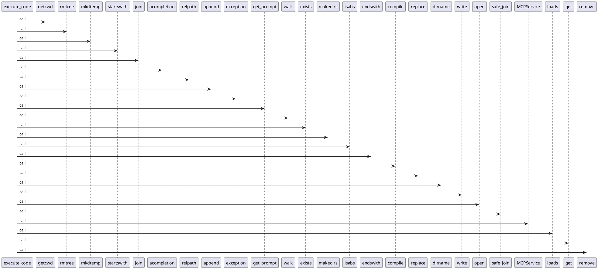
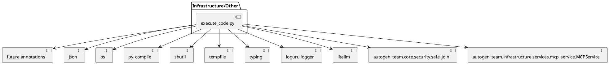
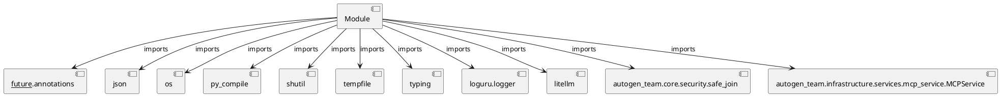

# Module Specification: execute_code

* **Source Reference:** `src/autogen_team/application/mcp/tools/execute_code.py`

## 1. Architectural Role & Responsibilities
**Purpose:**
Provides functionality related to execute code.

**Architecture Layer:**
- Infrastructure/Other

**Responsibilities:**
- Manages operations and logic for execute code.

**Main Workflow:**
- Executes the primary flow defined by execute code functions and classes.

## 2. Dependencies
**Imports:**
- `__future__.annotations`
- `json`
- `os`
- `py_compile`
- `shutil`
- `tempfile`
- `typing`
- `loguru.logger`
- `litellm`
- `autogen_team.core.security.safe_join`
- `autogen_team.infrastructure.services.mcp_service.MCPService`

**Exported Classes:**
- None

**Exported Functions:**
- `execute_code`

**Exported Interfaces:**
- Not explicitly defined.

**Public API:**
- Not explicitly defined.

## 3. Architecture & Execution
### Internal Architecture
Not explicitly defined.

### Execution Flow
Not explicitly defined.

### Sequence Explanation
Not explicitly defined.

### Examples
Not explicitly defined.

## 4. UML 2.0 Diagrams
### Class Diagram

```plantuml
@startuml
    ' No classes found in module
@enduml
```

### Sequence Diagram

```plantuml
@startuml
    execute_code -> getcwd : call
    execute_code -> rmtree : call
    execute_code -> mkdtemp : call
    execute_code -> startswith : call
    execute_code -> join : call
    execute_code -> acompletion : call
    execute_code -> relpath : call
    execute_code -> append : call
    execute_code -> exception : call
    execute_code -> get_prompt : call
    execute_code -> walk : call
    execute_code -> exists : call
    execute_code -> makedirs : call
    execute_code -> isabs : call
    execute_code -> endswith : call
    execute_code -> compile : call
    execute_code -> replace : call
    execute_code -> dirname : call
    execute_code -> write : call
    execute_code -> open : call
    execute_code -> safe_join : call
    execute_code -> MCPService : call
    execute_code -> loads : call
    execute_code -> get : call
    execute_code -> remove : call
@enduml
```

### Component Diagram

```plantuml
@startuml
    package "Infrastructure/Other" {
        [execute_code.py]
    }
    [execute_code.py] --> [__future__.annotations]
    [execute_code.py] --> [json]
    [execute_code.py] --> [os]
    [execute_code.py] --> [py_compile]
    [execute_code.py] --> [shutil]
    [execute_code.py] --> [tempfile]
    [execute_code.py] --> [typing]
    [execute_code.py] --> [loguru.logger]
    [execute_code.py] --> [litellm]
    [execute_code.py] --> [autogen_team.core.security.safe_join]
    [execute_code.py] --> [autogen_team.infrastructure.services.mcp_service.MCPService]
@enduml
```

### Dependency Graph

```plantuml
@startuml
    [Module] --> [__future__.annotations] : imports
    [Module] --> [json] : imports
    [Module] --> [os] : imports
    [Module] --> [py_compile] : imports
    [Module] --> [shutil] : imports
    [Module] --> [tempfile] : imports
    [Module] --> [typing] : imports
    [Module] --> [loguru.logger] : imports
    [Module] --> [litellm] : imports
    [Module] --> [autogen_team.core.security.safe_join] : imports
    [Module] --> [autogen_team.infrastructure.services.mcp_service.MCPService] : imports
@enduml
```

## 5. Class & Method Specifications
## 6. Module Functions
### `execute_code(task: T.Dict[str, T.Any], workspace_path: str)`
Generate code changes for a task and validate in sandbox.

Args:
    task: A task dict (from DAG) with id, name, description.
    workspace_path: Path to the workspace root.

Returns:
    A dict with files_changed list and status.

**Inputs:**
- `task`
  - type: T.Dict[str, T.Any]
  - meaning: Represents the task parameter.
  - valid values: Any valid T.Dict[str, T.Any].
  - optional?: False
  - default value: None
- `workspace_path`
  - type: str
  - meaning: Represents the workspace path parameter.
  - valid values: Any valid str.
  - optional?: False
  - default value: None

**Output:**
- return type: `T.Dict[str, T.Any]`
- semantic meaning: Returns the result of execute code.
- possible null values: Yes, if T.Dict[str, T.Any] allows it.
- exceptions: Standard execution exceptions.

**Side Effects:**
- Database updates: Not explicitly defined.
- File operations: Not explicitly defined.
- Network calls: Not explicitly defined.
- Cache: Not explicitly defined.
- State changes: Not explicitly defined.

## 7. Call Graph

```plantuml
@startuml
[execute_code] --> [getcwd] : calls
[execute_code] --> [rmtree] : calls
[execute_code] --> [mkdtemp] : calls
[execute_code] --> [startswith] : calls
[execute_code] --> [join] : calls
[execute_code] --> [acompletion] : calls
[execute_code] --> [relpath] : calls
[execute_code] --> [append] : calls
[execute_code] --> [exception] : calls
[execute_code] --> [get_prompt] : calls
[execute_code] --> [walk] : calls
[execute_code] --> [exists] : calls
[execute_code] --> [makedirs] : calls
[execute_code] --> [isabs] : calls
[execute_code] --> [endswith] : calls
[execute_code] --> [compile] : calls
[execute_code] --> [replace] : calls
[execute_code] --> [dirname] : calls
[execute_code] --> [write] : calls
[execute_code] --> [open] : calls
[execute_code] --> [safe_join] : calls
[execute_code] --> [MCPService] : calls
[execute_code] --> [loads] : calls
[execute_code] --> [get] : calls
[execute_code] --> [remove] : calls
@enduml
```

## 8. Cross References
- **Parent module:** __init__.md
- **Child modules:** None
- **Dependencies:** `shutil`, `os`, `autogen_team.infrastructure.services.mcp_service.MCPService`, `__future__.annotations`, `typing`, `py_compile`, `loguru.logger`, `autogen_team.core.security.safe_join`, `tempfile`, `litellm`, `json`
- **Used by:** None
- **Calls:** getcwd, rmtree, mkdtemp, startswith, join, acompletion, relpath, append, exception, get_prompt, walk, exists, makedirs, isabs, endswith, compile, replace, dirname, write, open, safe_join, MCPService, loads, get, remove
- **Called from:** ../../../../../tests/application/mcp/tools/test_execute_code.md, ../../../../../tests/security/test_mcp_path_traversal.md
- **Related classes:** [Classes](../../../../../../classes/index.md)
- **Related interfaces:** Not explicitly defined.
- **Related diagrams:** [Diagrams](../../../../../../diagrams/index.md)
