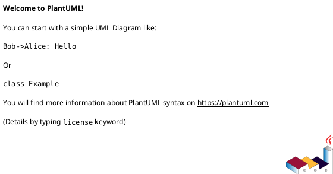
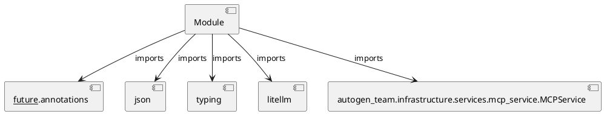

# Module Specification: generate_mission_docs

* **Source Reference:** `src/autogen_team/application/mcp/tools/generate_mission_docs.py`

## 1. Architectural Role & Responsibilities
**Purpose:**
Provides functionality related to generate mission docs.

**Architecture Layer:**
- Infrastructure/Other

**Responsibilities:**
- Manage and execute operations for generate_mission_docs.

**Main Workflow:**
- Initialize components and process requests for generate_mission_docs.

## 2. Dependencies
**Imports:**
- `__future__.annotations`
- `json`
- `typing`
- `litellm`
- `autogen_team.infrastructure.services.mcp_service.MCPService`

**Exported Classes:**
- None

**Exported Functions:**
- `generate_mission_docs`

## 3. Architecture & Execution
### Internal Architecture
Follows standard modular design, encapsulating state and behavior within defined classes and functions.

### Execution Flow
Sequential execution of defined functions and class methods.

### Sequence Explanation
Clients instantiate classes or call functions, which execute business logic and return results.

## 4. UML 2.0 Diagrams
### Class Diagram

### Dependency Graph

## 5. Class & Method Specifications
## 6. Module Functions
### `generate_mission_docs(mission_id: str, mission_context: Any)`
Generate Mermaid diagrams and documentation for a mission.

Args:
    mission_id: Unique identifier for the mission.
    mission_context: Context including goal, tasks, results, and file changes.

Returns:
    A dict containing generated Mermaid diagrams and documentation.

**Inputs:**
- `mission_id`: str
- `mission_context`: Any

**Output:**
- Return Type: `Any`
